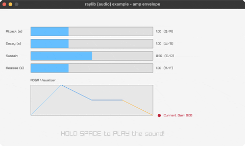

# amp-envelope

ADSR amplitude envelope on a 440Hz tone

Category: audio



## Run it

```sh
cd amp-envelope && bb run   # from this demo (or jolt run, jolt -M:run)
bb amp-envelope             # from the repo root (or jolt -M:amp-envelope)
```

## About

raylib [audio] example - amp envelope.

An ADSR amplitude envelope on a 440Hz tone: HOLD SPACE to play, the gain
rises through Attack, falls through Decay, holds at Sustain and fades
through Release when you let go. Q/A, W/S, E/D, R/F adjust the four
parameters, with the envelope shape drawn and a live gain dot. ESC quits.

No new FFI: reuses audio-raw-stream.clj's exact refill pattern
(rl/update-audio-stream takes a plain Clojure seq of floats), just with
the sine's amplitude shaped by an ADSR envelope stepped once per sample
and threaded through the buffer-fill loop.
Ported from raylib's examples/audio/audio_amp_envelope.c.
