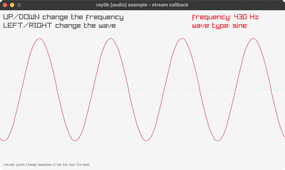

# audio-stream-callback

raudio pulls samples from its own thread

Category: audio



## Run it

```sh
cd audio-stream-callback && bb run   # from this demo (or jolt run, jolt -M:run)
bb audio-stream-callback             # from the repo root (or jolt -M:audio-stream-callback)
```

## About

raylib [audio] example - stream callback (`jolt -M:audio-stream-callback`).

Port of raylib's examples/audio/audio_stream_callback.c. A 44.1kHz mono stream
that raudio pulls from rather than one this code pushes to: UP and DOWN change
the pitch, LEFT and RIGHT cycle sine, square, triangle and sawtooth. The
samples raudio actually took are drawn underneath.

The pull is the point, and it is the harder of the suite's two callbacks.
`custom-logging` gives raylib a function pointer raylib calls on whichever
thread called into it, which is this one. raudio runs its OWN audio thread and
calls back from there, on a thread jolt never started, so the entry point needs
jolt's `:collect-safe`, which reactivates the thread before any jolt code runs
on it. Without that the process dies with a memory fault no handler can catch.

Being on the audio thread also sets the budget: the callback owes raudio its
samples before the device underruns, so the loop writes floats straight into
raudio's buffer with `ffi/write` and allocates nothing per sample. The scope at
the bottom is the same discipline. It is a plain native ring buffer the
callback writes a second copy into, with its cursor kept in the last four bytes
of the same block, so drawing what played costs the audio thread one more
float store and no allocation at all.

Contrast with `audio-raw-stream`, which pushes: it asks
`IsAudioStreamProcessed` every frame and refills with `UpdateAudioStream` when
raudio has drained a buffer. Same sound, opposite direction, and the push
version never leaves the main thread.
