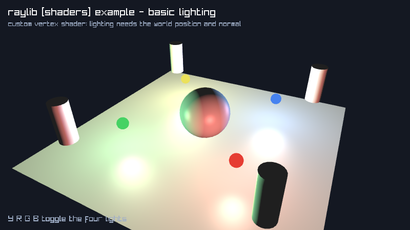

# basic-lighting

four point lights, custom vertex shader

Category: shaders



## Run it

```sh
cd basic-lighting && bb run   # from this demo (or jolt run, jolt -M:run)
bb basic-lighting             # from the repo root (or jolt -M:basic-lighting)
```

## About

raylib [shaders] example - basic lighting (`jolt -M:basic-lighting`).

Port of raylib's examples/shaders/shaders_basic_lighting.c. Four coloured
point lights over a few generated meshes, shaded per fragment with a
Blinn-Phong term.

This is the first example here with a custom VERTEX shader. Every other
shader in the suite is fragment-only, running against raylib's default
vertex stage, which is enough when you are transforming colours that are
already on screen. Lighting is not: the fragment stage needs the surface
position in world space and the normal after the model transform, and
raylib's default vertex shader passes neither. Hence rl/shader-vf, which
takes both sources, beside the fragment-only rl/shader.

One non-obvious step makes or breaks it, and it is easy to get wrong in a
way that still renders. The shader needs the eye position to compute a
specular term, and raylib does not supply it. SHADER_LOC_VECTOR_VIEW exists
in raylib's enum and nowhere else in its source: the C examples use that slot
purely to stash a location they then pass to SetShaderValue themselves every
frame. So this example keeps the location in an ordinary binding and writes
it each frame. Skip that write and viewPos stays at the origin, which leaves
the diffuse term untouched and only moves the highlights, so the scene still
looks lit and is quietly wrong.

raylib ships this as resources/shaders/glsl330/lighting.{vs,fs} plus a
rlights.h helper. No files ship here, so both shaders are inline strings and
the rlights Light struct is a plain Clojure map whose uniforms are pushed by
light-uniforms!. Nothing in that header needed FFI: it is uniform plumbing.
