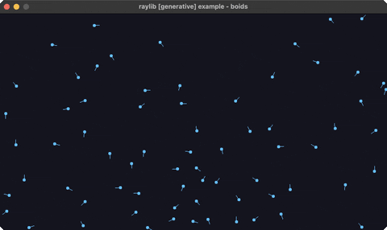

<!-- Generated by `bb resync` from raylib-jlt. Edits here are overwritten. -->
# boids

flocking birds (separation/alignment/cohesion)

Category: generative



## Run it

```sh
cd boids && bb run   # from this demo (or jolt run, jolt -M:run)
bb boids             # from the repo root (or jolt -M:boids)
```

## About

raylib [generative] example - Reynolds boids. ~70 agents flock via separation,
alignment, and cohesion; each drawn as a dot with a heading line along its velocity.
Pure vector math.
