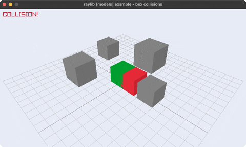

<!-- Generated by `bb resync` from raylib-jlt. Edits here are overwritten. -->
# box-collisions

a player cube colliding with 3D boxes

Category: 3d



## Run it

```sh
cd box-collisions && bb run   # from this demo (or jolt run, jolt -M:run)
bb box-collisions             # from the repo root (or jolt -M:box-collisions)
```

## About

raylib [models] example - box collisions (`joltc -M:box-collisions`).

A player cube moves with WASD across a grid; each static obstacle box turns red
when the player's box overlaps it (3D AABB overlap, computed in Clojure, no
by-value Rectangle/BoundingBox needed). Reuses the 3D path (Camera3D by value +
rl/cube!) under a fixed 3/4 camera. The player spawns already touching one box,
so the collision highlight is visible from frame 0.
