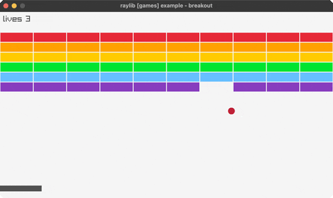

# breakout

paddle + ball + brick grid (mouse paddle)

Category: games



## Run it

```sh
cd breakout && bb run   # from this demo (or jolt run, jolt -M:run)
bb breakout             # from the repo root (or jolt -M:breakout)
```

## About

raylib [games] example - breakout. The paddle follows the mouse; bounce the ball
to clear every brick. Ball/wall/paddle/brick collisions computed in Clojure.
