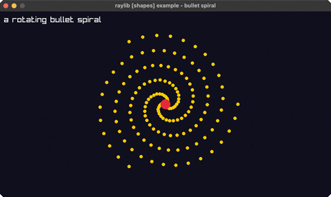

# bullet-hell

a rotating bullet spiral

Category: shapes

Ported from raylib's `examples/shapes/shapes_bullet_hell.c`.



## Run it

```sh
cd bullet-hell && bb run   # from this demo (or jolt run, jolt -M:run)
bb bullet-hell             # from the repo root (or jolt -M:bullet-hell)
```

## About

raylib [shapes] example - bullet spiral (`joltc -M:bullet-hell`).

A rotating emitter at the centre sprays bullets outward in a three-armed spiral;
each bullet flies until it leaves the window. Pure math over draw-circle.
