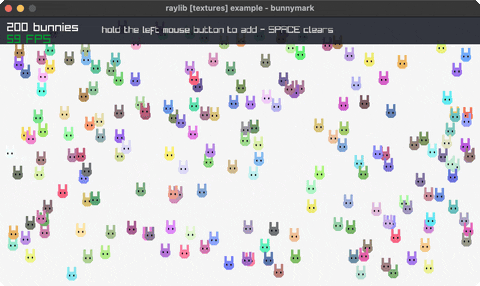

<!-- Generated by `bb resync` from raylib-jlt. Edits here are overwritten. -->
# bunnymark

the sprite-count benchmark (click to add)

Category: textures



## Run it

```sh
cd bunnymark && bb run   # from this demo (or jolt run, jolt -M:run)
bb bunnymark             # from the repo root (or jolt -M:bunnymark)
```

## About

raylib [textures] example - bunnymark (`jolt -M:bunnymark`).

The traditional sprite-count benchmark: hold the left mouse button to spawn
bunnies, each bouncing off the window edges with its own velocity and tint.
The readout tracks how many are on screen and what that does to the frame rate.
SPACE clears them.

raylib's version loads wabbit_alpha.png; there is no image loader here (see
net.b12n.raylib.textures on why LoadTexture has no binding), so the sprite
is drawn into an RGBA buffer by hand and uploaded with rlLoadTexture. Every
bunny is then one rl/texture! quad, which rlgl batches into the same draw call as long as they
all share the texture.
