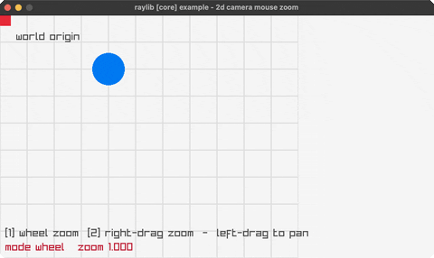

# camera-2d-mouse-zoom

zoom toward the cursor, pinning the point under it

Category: core



## Run it

```sh
cd camera-2d-mouse-zoom && bb run   # from this demo (or jolt run, jolt -M:run)
bb camera-2d-mouse-zoom             # from the repo root (or jolt -M:camera-2d-mouse-zoom)
```

## About

raylib [core] example - 2d camera mouse zoom (`jolt -M:camera-2d-mouse-zoom`).

Port of raylib's examples/core/core_2d_camera_mouse_zoom.c. Drag with the left
button to pan. Key 1 zooms on the mouse wheel, key 2 zooms by dragging with the
right button.

Zooming toward the cursor is the trick worth reading. Scaling the camera alone
zooms toward its target, which is wherever the camera happens to be looking, so
the point under the cursor slides away. Pinning it takes three steps in order:
find the world point under the cursor at the current zoom, move the camera's
offset to the cursor's screen position, then set its target to that world
point. After that the same world point sits under the same pixel at any zoom.

Zoom is stepped in log space, `exp(log(zoom) + 0.2*wheel)`, so each notch is a
constant ratio. Adding to zoom directly makes a notch feel enormous when zoomed
out and negligible when zoomed in.

Neither GetScreenToWorld2D nor GetMouseDelta is bound. Both take or return a
Vector2 by value, which the pointer trick does not cover. Both are a couple of
lines of arithmetic here: the inverse camera transform, and the difference
against the previous frame's cursor position.
