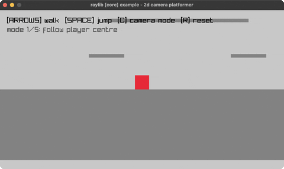

<!-- Generated by `bb resync` from raylib-jlt. Edits here are overwritten. -->
# camera-2d-platformer

five ways a camera can follow a jumping player

Category: core



## Run it

```sh
cd camera-2d-platformer && jolt -M:run   # from this demo
jolt -M:camera-2d-platformer             # from the repo root
```

## About

raylib [core] example - 2d camera platformer (`jolt -M:camera-2d-platformer`).

Port of raylib's examples/core/core_2d_camera_platformer.c. Arrows walk, SPACE
jumps, C cycles five ways a camera can follow a player and R puts everything
back.

The five modes are the example. Watching the same jump under each one is the
fastest way to feel why a platformer's camera is a design decision rather than
a formula:

- centre: target the player exactly, so the world lurches with every hop.
- clamped: the same, but never past the map edges, so the level's border stays
  put instead of revealing emptiness.
- smooth: chase the player at a speed proportional to the distance, so the
  camera lags and catches up.
- even-out: follow horizontally at once but ease vertically only after landing,
  which stops a jump from moving the view at all.
- bounds push: hold still until the player reaches a margin, then shove.

Two upstream helpers are not bound, and both fall out of arithmetic already
here. GetWorldToScreen2D is the camera transform, used by the clamped mode to
ask where a map corner has landed on screen. Vector2Length and friends are
ordinary maths.

Collision is deliberately the C's: a one-way platform test that only catches a
player falling THROUGH the top edge this frame. Walking into a platform's side
does nothing, which is what makes the level feel like a platformer rather than
a maze. See camera-2d for the simpler follow, and camera-2d-mouse-zoom for
zoom pinned to the cursor.
