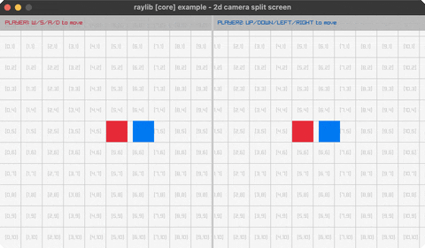

<!-- Generated by `bb resync` from raylib-jlt. Edits here are overwritten. -->
# camera-2d-split-screen

two players, two cameras, two render textures

Category: core



## Run it

```sh
cd camera-2d-split-screen && jolt -M:run   # from this demo
jolt -M:camera-2d-split-screen             # from the repo root
```

## About

raylib [core] example - 2D camera split screen.

Two players roam one shared grid world, each rendered through its own
Camera2D into its own half-screen render texture, then the two textures are
drawn side by side. W/S/A/D moves player one (red), the arrow keys move
player two (blue). No new FFI: composes with-camera-2d, rl/render-texture
and rl/texture! exactly as camera2d.clj and render_texture.clj already do.
Ported from raylib's examples/core/core_2d_camera_split_screen.c.
