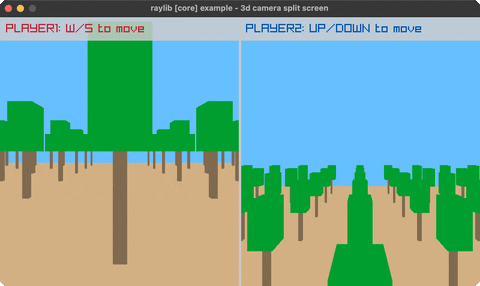

<!-- Generated by `bb resync` from raylib-jlt. Edits here are overwritten. -->
# camera-3d-split-screen

two players, two render-texture halves

Category: 3d



## Run it

```sh
cd camera-3d-split-screen && bb run   # from this demo (or jolt run, jolt -M:run)
bb camera-3d-split-screen             # from the repo root (or jolt -M:camera-3d-split-screen)
```

## About

raylib [core] example - 3d camera split screen.

Two players roam a plane of cube trees, each seeing the world from their
own camera in half the screen: player 1 moves with W/S (along z), player
2 with UP/DOWN (along x); each is drawn as a colored cube in both views.
Each half is rendered into its own render texture, then blitted side by
side, same y-flip convention every other render-texture blit in this
suite uses. The one new binding this needed was DrawPlane, genuinely by
value now that Vector2/Vector3 by-value args work (see draw-cube! and
friends in net.b12n.raylib.models). Ported from raylib's
examples/core/core_3d_camera_split_screen.c.
