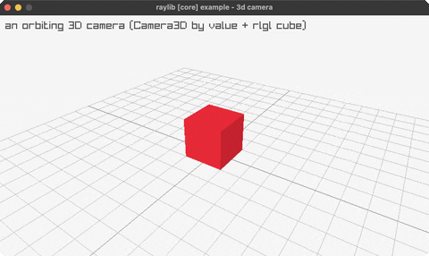

<!-- Generated by `bb resync` from raylib-jlt. Edits here are overwritten. -->
# camera-3d

an orbiting 3D camera (Camera3D by value)

Category: 3d



## Run it

```sh
cd camera-3d && jolt -M:run   # from this demo
jolt -M:camera-3d             # from the repo root
```

## About

raylib [core] example - 3D camera (`joltc -M:camera-3d`).

An orbiting perspective camera looks at a shaded cube standing on a ground grid.

This is the project's 3D milestone. It proves two things at once:
 • Camera3D (a 44-byte struct) is passed BY VALUE to BeginMode3D via a pointer,
   the same >16-byte-struct-by-pointer trick as Camera2D (net.b12n.raylib.camera/with-camera-3d).
 • The cube is built with rlgl immediate mode (net.b12n.raylib.models/cube! → rl-vertex-3f)
   because raylib's DrawCube takes a Vector3 BY VALUE, a 12-byte float struct
   passed in FP registers, which the pointer trick does NOT cover. DrawGrid is
   scalar.
