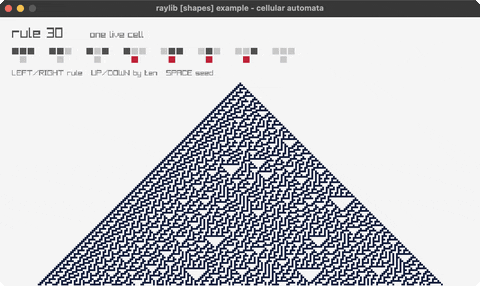

# cellular-automata

Wolfram's elementary automata

Category: generative



## Run it

```sh
cd cellular-automata && bb run   # from this demo (or jolt run, jolt -M:run)
bb cellular-automata             # from the repo root (or jolt -M:cellular-automata)
```

## About

raylib [shapes] example - elementary cellular automata (`jolt -M:cellular-automata`).

Wolfram's one-dimensional automata, one generation per row down the screen. Each
cell's next state is decided by itself and its two neighbours, and the eight
possible neighbourhoods are read off the eight bits of the rule number: rule 30
is chaotic, rule 90 draws a Sierpinski triangle, rule 110 is complicated enough
to be Turing complete.

LEFT/RIGHT step through the rules, UP/DOWN jump by ten, SPACE toggles between a
single live cell in the middle and a random first row. The panel underneath the
title spells the current rule out as the eight neighbourhood transitions it
stands for.
