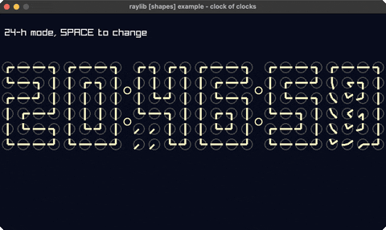

<!-- Generated by `bb resync` from raylib-jlt. Edits here are overwritten. -->
# clock-of-clocks

six digits spelled by a grid of clock hands

Category: generative



## Run it

```sh
cd clock-of-clocks && bb run   # from this demo (or jolt run, jolt -M:run)
bb clock-of-clocks             # from the repo root (or jolt -M:clock-of-clocks)
```

## About

raylib [shapes] example - clock of clocks (`jolt -M:clock-of-clocks`).

Port of raylib's examples/shapes/shapes_clock_of_clocks.c. Six digits, each a
4x6 grid of little clock faces, whose 48 hands swing into place to spell the
time. Every digit is a lookup of 24 hand-angle pairs, and a second's tick lerps
from wherever the hands are to wherever the next digit wants them.

raylib draws each hand with DrawRectanglePro, a rotated rectangle. Nothing here
binds that, because it takes a Rectangle and a Vector2 by value, both of which
the pointer trick does not cover. A hand is a thick line from the centre
outward, so line-ex! draws the same thing from the same angle.

Angles are raylib's screen convention: 0 points right, and positive turns
clockwise because y grows downward. So TL, the top-left corner of a digit
outline, is {0, 90}: one hand right, one hand down, meeting its neighbours.

See analog-clock for the same idea reduced to one large face.
