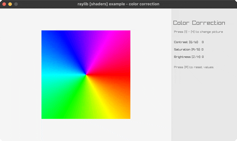

<!-- Generated by `bb resync` from raylib-jlt. Edits here are overwritten. -->
# color-correction

contrast/saturation/brightness shader

Category: shaders



## Run it

```sh
cd color-correction && jolt -M:run   # from this demo
jolt -M:color-correction             # from the repo root
```

## About

raylib [shaders] example - color correction.

A post-process fragment shader adjusts contrast, saturation and
brightness of a picture in real time. Press 1-4 to switch picture; hold
Q/W contrast, A/S saturation, Z/X brightness; R resets.

No new FFI: the same uniform-loc / set-uniform-float! / with-shader
every other shader example uses. The shader's grading math (contrast
around the midpoint, additive brightness, luminance-weighted
saturation) is the standard technique, the same formula raylib's own
color_correction.fs uses, since there isn't really another way to
define what those three sliders mean. The four pictures are
procedurally generated with rl/texture-from-fn rather than the C
example's parrots/cat/mandrill/fudesumi PNGs, matching this suite's
no-external-assets convention.
Loosely based on raylib/examples/shaders/shaders_color_correction.c.
