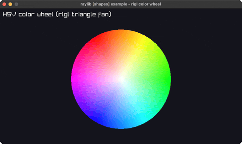

# color-wheel

an HSV color wheel (rlgl triangle fan)

Category: shapes

Ported from raylib's `examples/shapes/shapes_rlgl_color_wheel.c`.



## Run it

```sh
cd color-wheel && bb run   # from this demo (or jolt run, jolt -M:run)
bb color-wheel             # from the repo root (or jolt -M:color-wheel)
```

## About

raylib [shapes] example - rlgl color wheel. A hue ring drawn as an rlgl triangle
fan: each slice's rim vertices carry an HSV->RGB color (s=v=1), the center is white.
Port of shapes_rlgl_color_wheel (minus the raygui value slider); the hue offset
rotates slowly so the wheel animates.
