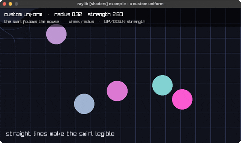

<!-- Generated by `bb resync` from raylib-jlt. Edits here are overwritten. -->
# custom-uniform

a mouse-steered swirl over a scene

Category: shaders



## Run it

```sh
cd custom-uniform && jolt -M:run   # from this demo
jolt -M:custom-uniform             # from the repo root
```

## About

raylib [shaders] example - a custom uniform (`jolt -M:custom-uniform`).

The same two-pass structure as `postprocessing`, but the point here is the
uniform rather than the effect: a swirl whose centre and strength come from
the mouse, uploaded every frame. One vec2 and two floats is the whole
interface between the loop and the shader.

The swirl rotates each sample around the centre by an angle that falls off
with distance, so the distortion is strongest under the pointer and fades to
nothing at the radius. Sampling is the inverse of the effect you want - to
make the image appear rotated one way, you read from a point rotated the
other - which is why the sign here looks backwards at first glance.

The wheel changes the radius; UP/DOWN change the strength.

Framebuffer textures are bottom-up in GL's convention, so the FBO is drawn
back with :v0 1.0 :v1 0.0.
