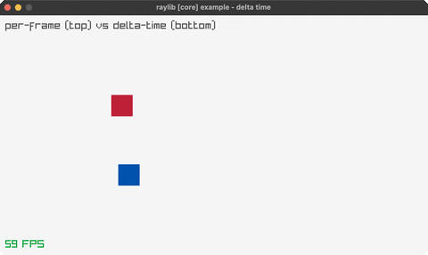

<!-- Generated by `bb resync` from raylib-jlt. Edits here are overwritten. -->
# delta-time

per-frame vs delta-time movement

Category: core

Ported from raylib's `examples/core/core_delta_time.c`.



## Run it

```sh
cd delta-time && bb run   # from this demo (or jolt run, jolt -M:run)
bb delta-time             # from the repo root (or jolt -M:delta-time)
```

## About

raylib [core] example - delta time (`joltc -M:delta-time`).

Two boxes cross the screen: the top one moves a fixed amount PER FRAME (so its
speed depends on the frame rate), the bottom one moves by GetFrameTime * speed
(frame-rate independent). Shows why delta time matters.
