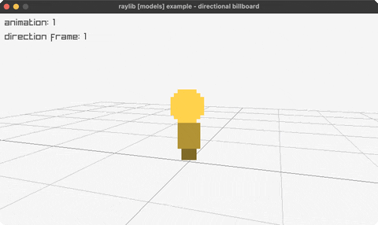

<!-- Generated by `bb resync` from raylib-jlt. Edits here are overwritten. -->
# directional-billboard

a billboard whose facing row turns with the camera

Category: 3d



## Run it

```sh
cd directional-billboard && jolt -M:run   # from this demo
jolt -M:directional-billboard             # from the repo root
```

## About

raylib [models] example - directional billboard.

A camera-facing sprite billboard whose row in a procedural sheet is chosen
from the orbiting camera's own angle, so the character appears to turn as
the camera circles it, and whose column cycles through a 4-frame walk
animation. Combines two techniques from earlier in this suite: the
camera-facing quad math from `billboard-rendering` (right/up from the
camera's forward vector, no spin here) and the UV sub-rect slicing from
`textured-cube`'s DrawCubeTextureRec, together the shape of raylib's
DrawBillboardPro (a by-value Texture2D + Rectangle, not bound here).

No new FFI. The sheet is 8 direction rows x 4 walk-frame columns, each cell
a small hue-by-direction figure with a two-frame leg wiggle, generated once
via rl/texture-from-fn rather than the upstream C example's skillbot.png.
Based on raylib/examples/models/models_directional_billboard.c.
