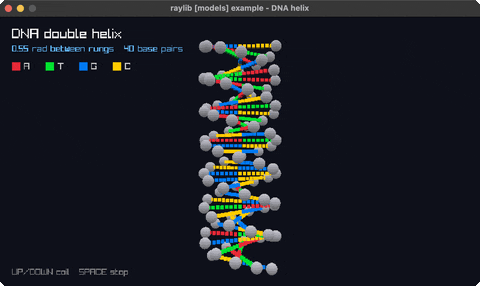

<!-- Generated by `bb resync` from raylib-jlt. Edits here are overwritten. -->
# dna-helix

a turning double helix, coloured bases

Category: 3d



## Run it

```sh
cd dna-helix && jolt -M:run   # from this demo
jolt -M:dna-helix             # from the repo root
```

## About

raylib [models] example - DNA helix (`jolt -M:dna-helix`).

A double helix: two phosphate backbones a half turn apart, with base pairs
runged between them and coloured by base. The whole thing turns under an
orbiting camera. UP/DOWN change how tightly it coils, SPACE stops the rotation.

Backbone spheres and base pairs are rl/sphere! and rl/cube! from the library,
which are rlgl immediate-mode geometry rather than raylib's DrawSphere
and DrawCube: those take a Vector3 centre by value, which does not cross this
FFI boundary (see net.b12n.raylib.models).
