<!-- Generated by `bb resync`. Edits here are overwritten. -->
# Demo gallery

All 187 demos, grouped by category. Each name links to the demo's
own sub-project, where its page has the full description and source.

## 3d (28)

### [basic-voxel](https://github.com/jlt-commons/raylib-jolt-demo/tree/main/basic-voxel)

an 8x8x8 voxel block, click one out. Run it with `bb basic-voxel`.

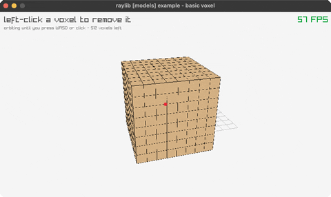

### [billboard-rendering](https://github.com/jlt-commons/raylib-jolt-demo/tree/main/billboard-rendering)

camera-facing quads, one spins. Run it with `bb billboard-rendering`.

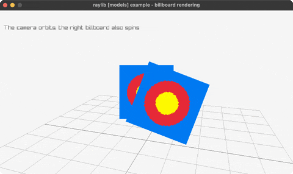

### [bouncing-spheres](https://github.com/jlt-commons/raylib-jolt-demo/tree/main/bouncing-spheres)

spheres bouncing in a 3D box (rl/sphere!). Run it with `bb bouncing-spheres`.

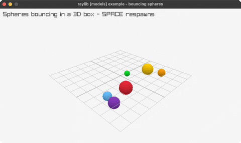

### [box-collisions](https://github.com/jlt-commons/raylib-jolt-demo/tree/main/box-collisions)

a player cube colliding with 3D boxes. Run it with `bb box-collisions`.

### [camera-3d](https://github.com/jlt-commons/raylib-jolt-demo/tree/main/camera-3d)

an orbiting 3D camera (Camera3D by value). Run it with `bb camera-3d`.

### [camera-3d-first-person](https://github.com/jlt-commons/raylib-jolt-demo/tree/main/camera-3d-first-person)

walk a yard of columns in first person. Run it with `bb camera-3d-first-person`.

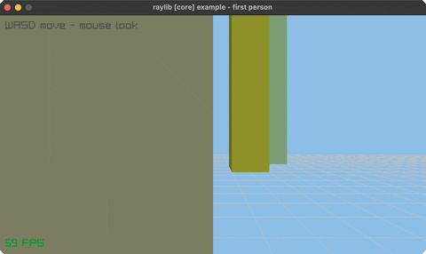

### [camera-3d-free](https://github.com/jlt-commons/raylib-jolt-demo/tree/main/camera-3d-free)

a free-look camera around a cube, UpdateCamera. Run it with `bb camera-3d-free`.

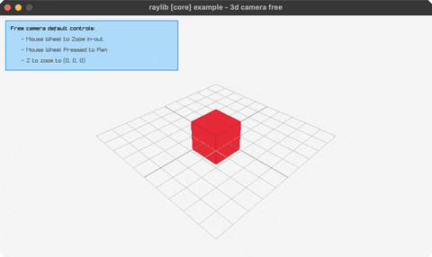

### [camera-3d-split-screen](https://github.com/jlt-commons/raylib-jolt-demo/tree/main/camera-3d-split-screen)

two players, two render-texture halves. Run it with `bb camera-3d-split-screen`.

### [directional-billboard](https://github.com/jlt-commons/raylib-jolt-demo/tree/main/directional-billboard)

a billboard whose facing row turns with the camera. Run it with `bb directional-billboard`.

### [dna-helix](https://github.com/jlt-commons/raylib-jolt-demo/tree/main/dna-helix)

a turning double helix, coloured bases. Run it with `bb dna-helix`.

### [doom](https://github.com/jlt-commons/raylib-jolt-demo/tree/main/doom)

a textured raycaster: one ray per screen column. Run it with `bb doom`.

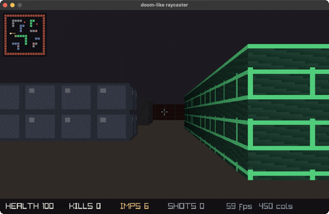

### [first-person-maze](https://github.com/jlt-commons/raylib-jolt-demo/tree/main/first-person-maze)

walk a grid maze, with a minimap. Run it with `bb first-person-maze`.

### [geometric-shapes](https://github.com/jlt-commons/raylib-jolt-demo/tree/main/geometric-shapes)

cubes, spheres, cylinders, cones, capsules. Run it with `bb geometric-shapes`.

### [helitorus](https://github.com/jlt-commons/raylib-jolt-demo/tree/main/helitorus)

a helix wound around a torus, swept into a tube. Run it with `bb helitorus`.

### [lorenz-attractor](https://github.com/jlt-commons/raylib-jolt-demo/tree/main/lorenz-attractor)

the Lorenz attractor traced in 3D. Run it with `bb lorenz-attractor`.

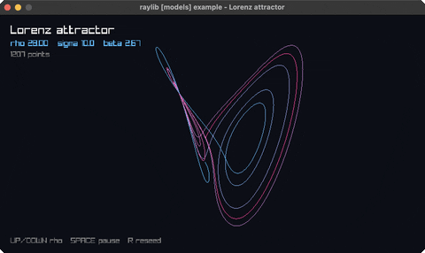

### [mesh-generation](https://github.com/jlt-commons/raylib-jolt-demo/tree/main/mesh-generation)

eight GenMesh shapes, drawn with DrawMesh. Run it with `bb mesh-generation`.

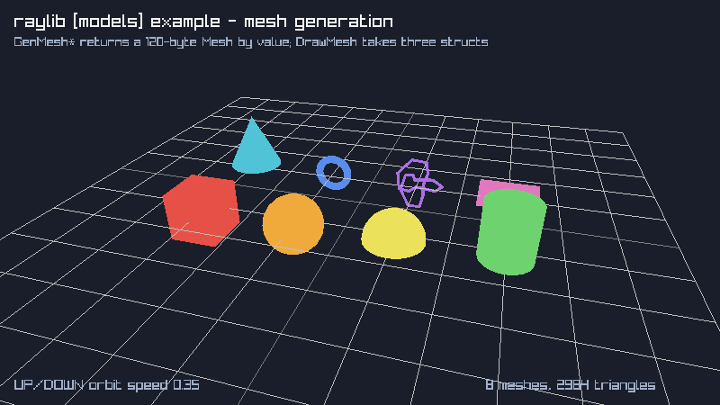

### [orthographic-projection](https://github.com/jlt-commons/raylib-jolt-demo/tree/main/orthographic-projection)

perspective vs orthographic (SPACE toggles). Run it with `bb orthographic-projection`.

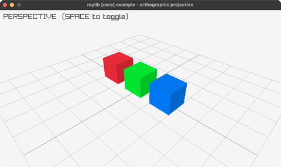

### [picking-3d](https://github.com/jlt-commons/raylib-jolt-demo/tree/main/picking-3d)

click a box: a real GetScreenToWorldRay pick. Run it with `bb picking-3d`.

### [point-cloud](https://github.com/jlt-commons/raylib-jolt-demo/tree/main/point-cloud)

~1500 points as tiny rlgl cubes, rotating. Run it with `bb point-cloud`.

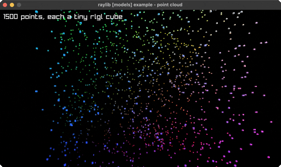

### [rlgl-solar-system](https://github.com/jlt-commons/raylib-jolt-demo/tree/main/rlgl-solar-system)

Sun/Earth/Moon via the rlgl matrix stack. Run it with `bb rlgl-solar-system`.

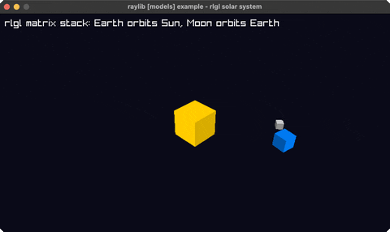

### [rotating-cube](https://github.com/jlt-commons/raylib-jolt-demo/tree/main/rotating-cube)

a single cube spinning via the rlgl matrix stack. Run it with `bb rotating-cube`.

### [spinning-cubes](https://github.com/jlt-commons/raylib-jolt-demo/tree/main/spinning-cubes)

a row of cubes each spinning with a phase offset. Run it with `bb spinning-cubes`.

### [tesseract-view](https://github.com/jlt-commons/raylib-jolt-demo/tree/main/tesseract-view)

a rotating 4D hypercube projected to 2D. Run it with `bb tesseract-view`.

### [textured-cube](https://github.com/jlt-commons/raylib-jolt-demo/tree/main/textured-cube)

two cubes, one textured atlas, one sub-rect. Run it with `bb textured-cube`.

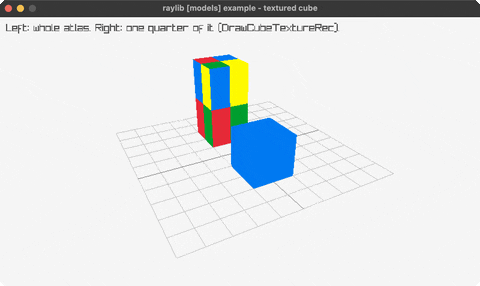

### [waving-cubes](https://github.com/jlt-commons/raylib-jolt-demo/tree/main/waving-cubes)

an NxN grid of cubes rippling in 3D. Run it with `bb waving-cubes`.

### [wireframe-shapes](https://github.com/jlt-commons/raylib-jolt-demo/tree/main/wireframe-shapes)

pyramid/octahedron/torus/helix in 3D lines. Run it with `bb wireframe-shapes`.

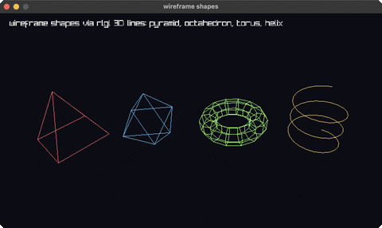

### [world-screen](https://github.com/jlt-commons/raylib-jolt-demo/tree/main/world-screen)

a 2D label tracks a cube via GetWorldToScreen. Run it with `bb world-screen`.

### [yaw-pitch-roll](https://github.com/jlt-commons/raylib-jolt-demo/tree/main/yaw-pitch-roll)

the three aircraft rotations in 3D. Run it with `bb yaw-pitch-roll`.

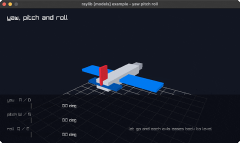

## audio (3)

### [amp-envelope](https://github.com/jlt-commons/raylib-jolt-demo/tree/main/amp-envelope)

ADSR amplitude envelope on a 440Hz tone. Run it with `bb amp-envelope`.

### [audio-raw-stream](https://github.com/jlt-commons/raylib-jolt-demo/tree/main/audio-raw-stream)

arrow keys steer a live sine tone's pitch/pan. Run it with `bb audio-raw-stream`.

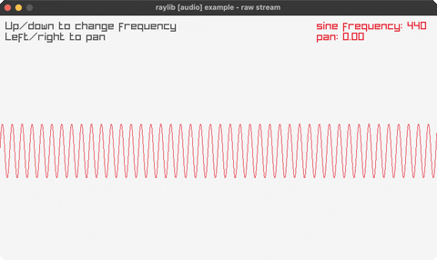

### [audio-stream-callback](https://github.com/jlt-commons/raylib-jolt-demo/tree/main/audio-stream-callback)

raudio pulls samples from its own thread. Run it with `bb audio-stream-callback`.

## core (34)

### [basic-screen-manager](https://github.com/jlt-commons/raylib-jolt-demo/tree/main/basic-screen-manager)

a LOGO/TITLE/GAMEPLAY/ENDING flow. Run it with `bb basic-screen-manager`.

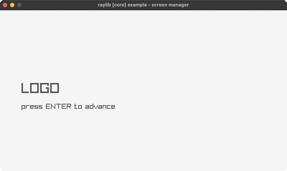

### [camera-2d-mouse-zoom](https://github.com/jlt-commons/raylib-jolt-demo/tree/main/camera-2d-mouse-zoom)

zoom toward the cursor, pinning the point under it. Run it with `bb camera-2d-mouse-zoom`.

### [camera-2d-platformer](https://github.com/jlt-commons/raylib-jolt-demo/tree/main/camera-2d-platformer)

five ways a camera can follow a jumping player. Run it with `bb camera-2d-platformer`.

### [camera-2d-split-screen](https://github.com/jlt-commons/raylib-jolt-demo/tree/main/camera-2d-split-screen)

two players, two cameras, two render textures. Run it with `bb camera-2d-split-screen`.

### [camera2d](https://github.com/jlt-commons/raylib-jolt-demo/tree/main/camera2d)

a 2D camera over a skyline (struct-by-value). Run it with `bb camera2d`.

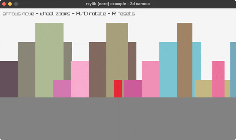

### [clipboard-text](https://github.com/jlt-commons/raylib-jolt-demo/tree/main/clipboard-text)

type, C copies, V pastes. Run it with `bb clipboard-text`.

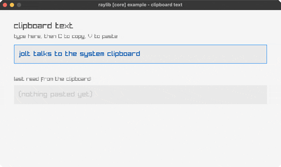

### [compute-hash](https://github.com/jlt-commons/raylib-jolt-demo/tree/main/compute-hash)

CRC32/MD5/SHA1/SHA256 + Base64 of typed text. Run it with `bb compute-hash`.

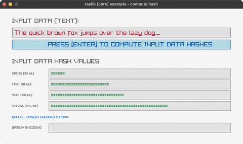

### [core](https://github.com/jlt-commons/raylib-jolt-demo/tree/main/core)

the minimal raylib window + text. Run it with `bb core`.

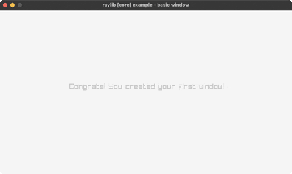

### [custom-logging](https://github.com/jlt-commons/raylib-jolt-demo/tree/main/custom-logging)

raylib's log captured by a jolt callback. Run it with `bb custom-logging`.

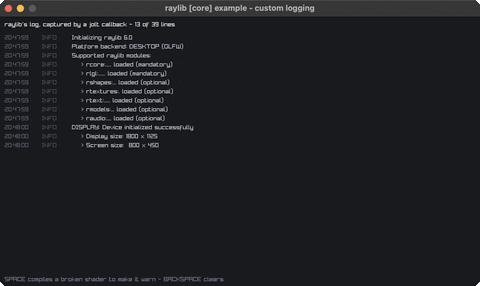

### [delta-time](https://github.com/jlt-commons/raylib-jolt-demo/tree/main/delta-time)

per-frame vs delta-time movement. Run it with `bb delta-time`.

### [directory-files](https://github.com/jlt-commons/raylib-jolt-demo/tree/main/directory-files)

a file browser over LoadDirectoryFilesEx. Run it with `bb directory-files`.

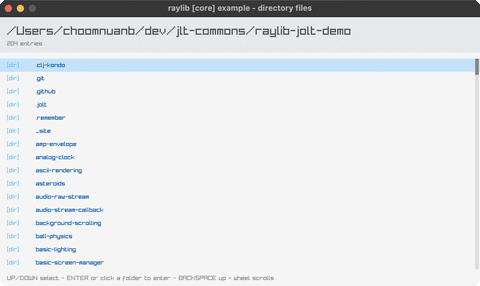

### [drop-files](https://github.com/jlt-commons/raylib-jolt-demo/tree/main/drop-files)

drag files in: FilePathList by value. Run it with `bb drop-files`.

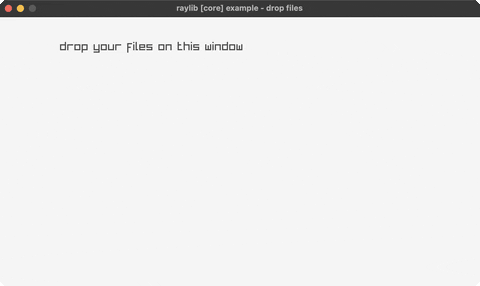

### [highdpi-demo](https://github.com/jlt-commons/raylib-jolt-demo/tree/main/highdpi-demo)

logical points vs physical pixels, two rulers. Run it with `bb highdpi-demo`.

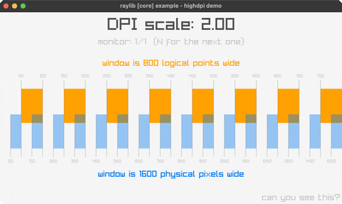

### [highdpi-testbed](https://github.com/jlt-commons/raylib-jolt-demo/tree/main/highdpi-testbed)

diagnostic overlay: monitors, DPI, crosshair. Run it with `bb highdpi-testbed`.

### [input](https://github.com/jlt-commons/raylib-jolt-demo/tree/main/input)

steer a ball with the arrow keys. Run it with `bb input`.

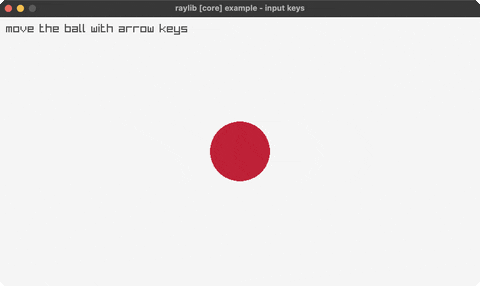

### [input-actions](https://github.com/jlt-commons/raylib-jolt-demo/tree/main/input-actions)

abstract input actions: keyboard + gamepad. Run it with `bb input-actions`.

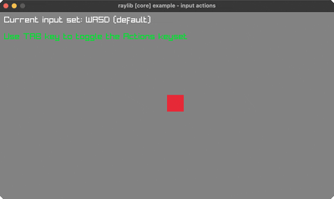

### [input-gamepad](https://github.com/jlt-commons/raylib-jolt-demo/tree/main/input-gamepad)

sticks, triggers and buttons for pad 0. Run it with `bb input-gamepad`.

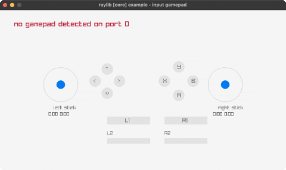

### [input-gestures](https://github.com/jlt-commons/raylib-jolt-demo/tree/main/input-gestures)

tap, hold, drag and swipe, named as they happen. Run it with `bb input-gestures`.

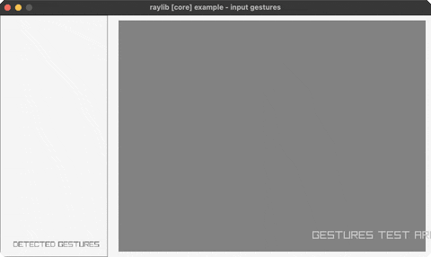

### [input-multitouch](https://github.com/jlt-commons/raylib-jolt-demo/tree/main/input-multitouch)

touch points (the mouse is point 0). Run it with `bb input-multitouch`.

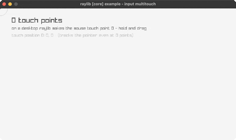

### [input-virtual-controls](https://github.com/jlt-commons/raylib-jolt-demo/tree/main/input-virtual-controls)

an on-screen D-pad and action button. Run it with `bb input-virtual-controls`.

### [keyboard-testbed](https://github.com/jlt-commons/raylib-jolt-demo/tree/main/keyboard-testbed)

an on-screen ENG-US keyboard, every key lit. Run it with `bb keyboard-testbed`.

### [monitor-detector](https://github.com/jlt-commons/raylib-jolt-demo/tree/main/monitor-detector)

every attached display, current one lit. Run it with `bb monitor-detector`.

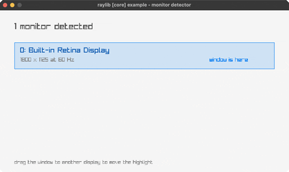

### [mouse](https://github.com/jlt-commons/raylib-jolt-demo/tree/main/mouse)

a ball follows the mouse; click to recolor. Run it with `bb mouse`.

### [random-sequence](https://github.com/jlt-commons/raylib-jolt-demo/tree/main/random-sequence)

bars in a shuffled order, each height used once. Run it with `bb random-sequence`.

### [random-values](https://github.com/jlt-commons/raylib-jolt-demo/tree/main/random-values)

a new random value every two seconds. Run it with `bb random-values`.

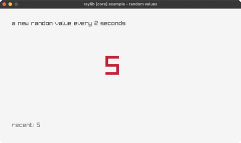

### [scissor-test](https://github.com/jlt-commons/raylib-jolt-demo/tree/main/scissor-test)

a scissor rectangle clips a grid. Run it with `bb scissor-test`.

### [smooth-pixelperfect](https://github.com/jlt-commons/raylib-jolt-demo/tree/main/smooth-pixelperfect)

sub-pixel camera smoothing at 5x upscale. Run it with `bb smooth-pixelperfect`.

### [storage-values](https://github.com/jlt-commons/raylib-jolt-demo/tree/main/storage-values)

values that survive a restart, via a file. Run it with `bb storage-values`.

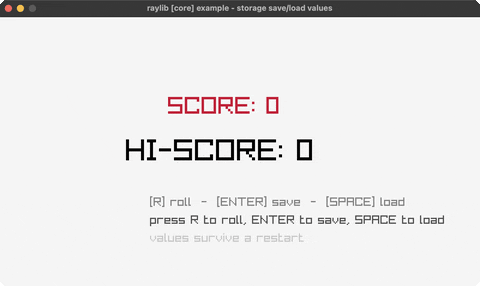

### [undo-redo](https://github.com/jlt-commons/raylib-jolt-demo/tree/main/undo-redo)

move a square, then step back through the history. Run it with `bb undo-redo`.

### [viewport-scaling](https://github.com/jlt-commons/raylib-jolt-demo/tree/main/viewport-scaling)

6 viewport-scaling policies, resize live. Run it with `bb viewport-scaling`.

### [wheel](https://github.com/jlt-commons/raylib-jolt-demo/tree/main/wheel)

scroll a box with the mouse wheel. Run it with `bb wheel`.

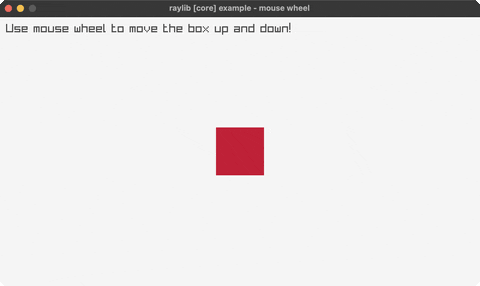

### [window-flags](https://github.com/jlt-commons/raylib-jolt-demo/tree/main/window-flags)

toggle vsync/resizable/topmost live. Run it with `bb window-flags`.

### [window-letterbox](https://github.com/jlt-commons/raylib-jolt-demo/tree/main/window-letterbox)

a fixed picture letterboxed into the window. Run it with `bb window-letterbox`.

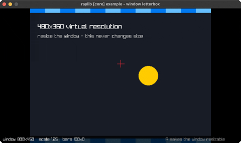

### [window-should-close](https://github.com/jlt-commons/raylib-jolt-demo/tree/main/window-should-close)

close is a question: ESC asks before it exits. Run it with `bb window-should-close`.

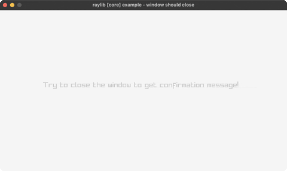

## games (11)

### [asteroids](https://github.com/jlt-commons/raylib-jolt-demo/tree/main/asteroids)

the classic vector shooter (rotate/thrust/fire). Run it with `bb asteroids`.

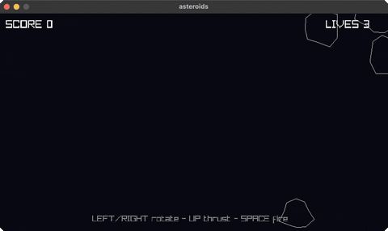

### [breakout](https://github.com/jlt-commons/raylib-jolt-demo/tree/main/breakout)

paddle + ball + brick grid (mouse paddle). Run it with `bb breakout`.

### [flappy-bird](https://github.com/jlt-commons/raylib-jolt-demo/tree/main/flappy-bird)

flap through the pipe gaps (SPACE). Run it with `bb flappy-bird`.

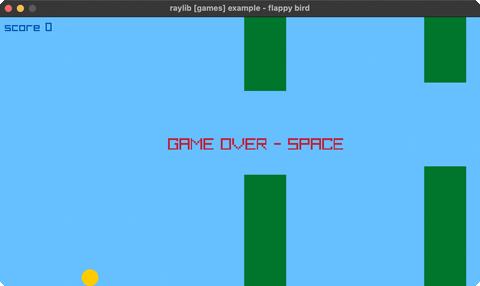

### [game-2048](https://github.com/jlt-commons/raylib-jolt-demo/tree/main/game-2048)

2048: 4x4 tile-merge puzzle (arrow keys). Run it with `bb game-2048`.

### [minesweeper](https://github.com/jlt-commons/raylib-jolt-demo/tree/main/minesweeper)

reveal/flag grid (mouse L reveal, R flag). Run it with `bb minesweeper`.

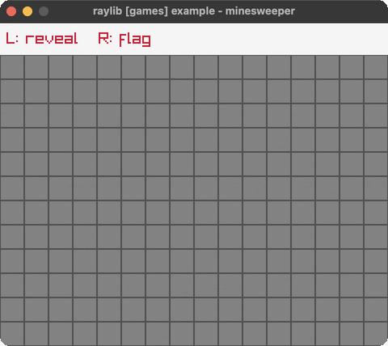

### [pacman](https://github.com/jlt-commons/raylib-jolt-demo/tree/main/pacman)

pac-man, with the classic ghost personalities. Run it with `bb pacman`.

### [pong](https://github.com/jlt-commons/raylib-jolt-demo/tree/main/pong)

two-paddle classic, you (W/S) vs a CPU. Run it with `bb pong`.

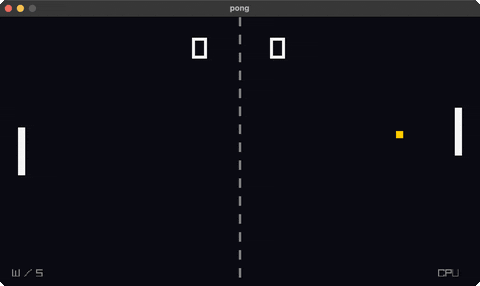

### [snake](https://github.com/jlt-commons/raylib-jolt-demo/tree/main/snake)

the classic snake (arrow keys, grow, don't crash). Run it with `bb snake`.

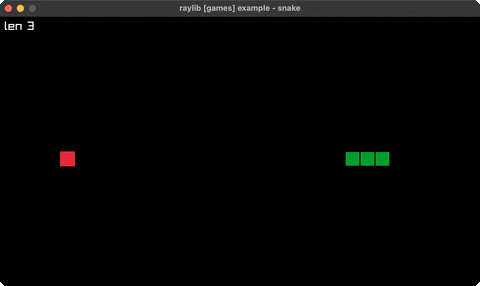

### [space-invaders](https://github.com/jlt-commons/raylib-jolt-demo/tree/main/space-invaders)

marching aliens (arrows + SPACE to shoot). Run it with `bb space-invaders`.

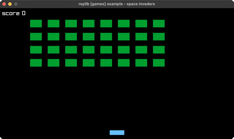

### [tetris](https://github.com/jlt-commons/raylib-jolt-demo/tree/main/tetris)

the block-stacking puzzle (move/rotate/drop). Run it with `bb tetris`.

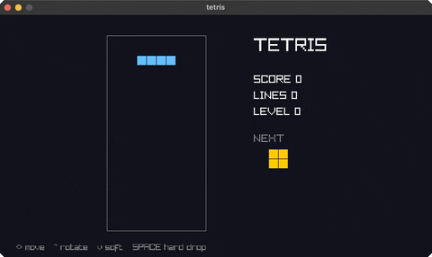

### [vampire-survivors](https://github.com/jlt-commons/raylib-jolt-demo/tree/main/vampire-survivors)

auto-fire survival: move, waves chase you. Run it with `bb vampire-survivors`.

## generative (10)

### [boids](https://github.com/jlt-commons/raylib-jolt-demo/tree/main/boids)

flocking birds (separation/alignment/cohesion). Run it with `bb boids`.

### [cellular-automata](https://github.com/jlt-commons/raylib-jolt-demo/tree/main/cellular-automata)

Wolfram's elementary automata. Run it with `bb cellular-automata`.

### [clock-of-clocks](https://github.com/jlt-commons/raylib-jolt-demo/tree/main/clock-of-clocks)

six digits spelled by a grid of clock hands. Run it with `bb clock-of-clocks`.

### [fireworks](https://github.com/jlt-commons/raylib-jolt-demo/tree/main/fireworks)

rockets + fading particle bursts. Run it with `bb fireworks`.

### [flow-field](https://github.com/jlt-commons/raylib-jolt-demo/tree/main/flow-field)

particles steered by a flow field (trails). Run it with `bb flow-field`.

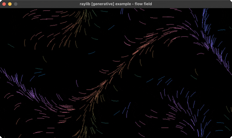

### [fourier-epicycles](https://github.com/jlt-commons/raylib-jolt-demo/tree/main/fourier-epicycles)

rotating circles trace a square wave. Run it with `bb fourier-epicycles`.

### [game-of-life](https://github.com/jlt-commons/raylib-jolt-demo/tree/main/game-of-life)

Conway's Game of Life (SPACE reseeds). Run it with `bb game-of-life`.

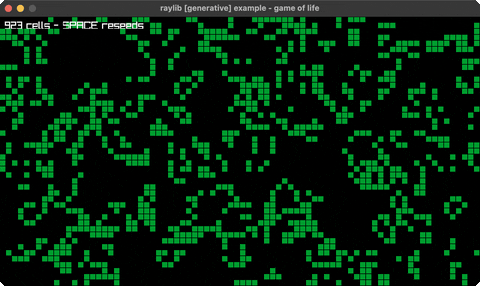

### [l-system](https://github.com/jlt-commons/raylib-jolt-demo/tree/main/l-system)

an L-system fractal plant (grows + regrows). Run it with `bb l-system`.

### [particles](https://github.com/jlt-commons/raylib-jolt-demo/tree/main/particles)

water/smoke/fire particles follow the mouse. Run it with `bb particles`.

### [spirograph](https://github.com/jlt-commons/raylib-jolt-demo/tree/main/spirograph)

animated hypotrochoid roulette curves. Run it with `bb spirograph`.

## shaders (20)

### [ascii-rendering](https://github.com/jlt-commons/raylib-jolt-demo/tree/main/ascii-rendering)

ascii art from a post-process shader. Run it with `bb ascii-rendering`.

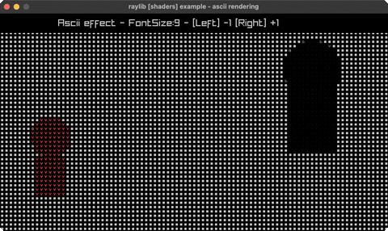

### [basic-lighting](https://github.com/jlt-commons/raylib-jolt-demo/tree/main/basic-lighting)

four point lights, custom vertex shader. Run it with `bb basic-lighting`.

### [color-correction](https://github.com/jlt-commons/raylib-jolt-demo/tree/main/color-correction)

contrast/saturation/brightness shader. Run it with `bb color-correction`.

### [custom-uniform](https://github.com/jlt-commons/raylib-jolt-demo/tree/main/custom-uniform)

a mouse-steered swirl over a scene. Run it with `bb custom-uniform`.

### [eratosthenes-sieve](https://github.com/jlt-commons/raylib-jolt-demo/tree/main/eratosthenes-sieve)

the Sieve of Eratosthenes, one test per pixel. Run it with `bb eratosthenes-sieve`.

### [fog-rendering](https://github.com/jlt-commons/raylib-jolt-demo/tree/main/fog-rendering)

exponential distance fog in the light shader. Run it with `bb fog-rendering`.

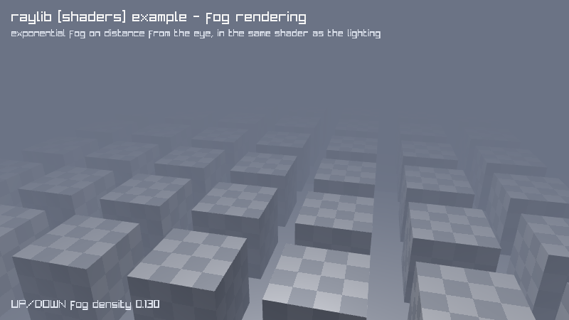

### [julia-set](https://github.com/jlt-commons/raylib-jolt-demo/tree/main/julia-set)

the Julia set, mouse-steered, in a shader. Run it with `bb julia-set`.

### [mandelbrot-set](https://github.com/jlt-commons/raylib-jolt-demo/tree/main/mandelbrot-set)

the Mandelbrot set, zoomable, in a shader. Run it with `bb mandelbrot-set`.

### [mesh-instancing](https://github.com/jlt-commons/raylib-jolt-demo/tree/main/mesh-instancing)

10000 lit cubes in one draw call. Run it with `bb mesh-instancing`.

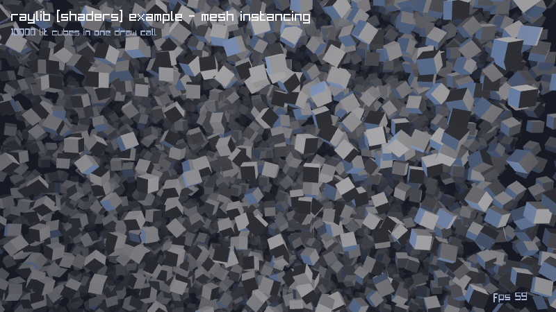

### [multi-sampler](https://github.com/jlt-commons/raylib-jolt-demo/tree/main/multi-sampler)

two textures blended by a second sampler. Run it with `bb multi-sampler`.

### [palette-switch](https://github.com/jlt-commons/raylib-jolt-demo/tree/main/palette-switch)

bands recolored by an ivec3 palette. Run it with `bb palette-switch`.

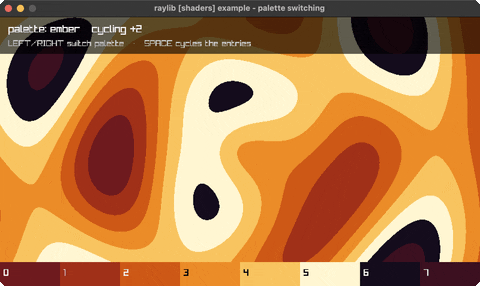

### [postprocessing](https://github.com/jlt-commons/raylib-jolt-demo/tree/main/postprocessing)

post-process shaders cycled over a scene. Run it with `bb postprocessing`.

### [raymarching](https://github.com/jlt-commons/raylib-jolt-demo/tree/main/raymarching)

a raymarched SDF scene in a shader. Run it with `bb raymarching`.

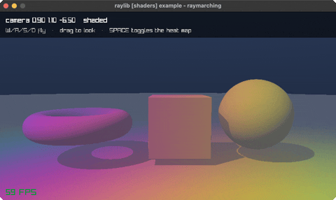

### [rounded-rect-shader](https://github.com/jlt-commons/raylib-jolt-demo/tree/main/rounded-rect-shader)

SDF rounded rects: fill, border, shadow. Run it with `bb rounded-rect-shader`.

### [shader-hot-reload](https://github.com/jlt-commons/raylib-jolt-demo/tree/main/shader-hot-reload)

swap and recompile the GLSL at runtime. Run it with `bb shader-hot-reload`.

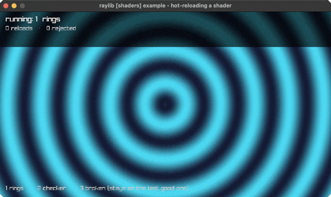

### [texture-outline](https://github.com/jlt-commons/raylib-jolt-demo/tree/main/texture-outline)

a shader outline around a sprite's alpha edge. Run it with `bb texture-outline`.

### [texture-painting](https://github.com/jlt-commons/raylib-jolt-demo/tree/main/texture-painting)

a blank texture painted by a shader. Run it with `bb texture-painting`.

### [texture-rendering](https://github.com/jlt-commons/raylib-jolt-demo/tree/main/texture-rendering)

a grid of squares painted entirely by a shader. Run it with `bb texture-rendering`.

### [texture-waves](https://github.com/jlt-commons/raylib-jolt-demo/tree/main/texture-waves)

a starfield rippled by a UV-displacement shader. Run it with `bb texture-waves`.

### [vertex-displacement](https://github.com/jlt-commons/raylib-jolt-demo/tree/main/vertex-displacement)

a flat plane made terrain in the vertex stage. Run it with `bb vertex-displacement`.

## shapes (45)

### [analog-clock](https://github.com/jlt-commons/raylib-jolt-demo/tree/main/analog-clock)

a live analog clock (libc local time). Run it with `bb analog-clock`.

### [ball-physics](https://github.com/jlt-commons/raylib-jolt-demo/tree/main/ball-physics)

2D balls under gravity, SPACE respawns. Run it with `bb ball-physics`.

### [bounce](https://github.com/jlt-commons/raylib-jolt-demo/tree/main/bounce)

a ball bouncing around the window. Run it with `bb bounce`.

### [bullet-hell](https://github.com/jlt-commons/raylib-jolt-demo/tree/main/bullet-hell)

a rotating bullet spiral. Run it with `bb bullet-hell`.

### [circle-sector-drawing](https://github.com/jlt-commons/raylib-jolt-demo/tree/main/circle-sector-drawing)

a sector whose segment count you can starve. Run it with `bb circle-sector-drawing`.

### [collision-area](https://github.com/jlt-commons/raylib-jolt-demo/tree/main/collision-area)

AABB collision between two boxes. Run it with `bb collision-area`.

### [color-wheel](https://github.com/jlt-commons/raylib-jolt-demo/tree/main/color-wheel)

an HSV color wheel (rlgl triangle fan). Run it with `bb color-wheel`.

### [colors](https://github.com/jlt-commons/raylib-jolt-demo/tree/main/colors)

every named raylib color in a grid. Run it with `bb colors`.

### [dashed-line](https://github.com/jlt-commons/raylib-jolt-demo/tree/main/dashed-line)

a dashed line follows the mouse. Run it with `bb dashed-line`.

### [digital-clock](https://github.com/jlt-commons/raylib-jolt-demo/tree/main/digital-clock)

a seven-segment HH:MM:SS clock (libc time). Run it with `bb digital-clock`.

### [double-pendulum](https://github.com/jlt-commons/raylib-jolt-demo/tree/main/double-pendulum)

chaotic double-pendulum motion + trail. Run it with `bb double-pendulum`.

### [easings](https://github.com/jlt-commons/raylib-jolt-demo/tree/main/easings)

a grid of balls, each on a different easing curve. Run it with `bb easings`.

### [easings-ball](https://github.com/jlt-commons/raylib-jolt-demo/tree/main/easings-ball)

slide, swell and fade, one curve each. Run it with `bb easings-ball`.

### [easings-box](https://github.com/jlt-commons/raylib-jolt-demo/tree/main/easings-box)

drop, flatten, spin, grow, fade: five curves. Run it with `bb easings-box`.

### [easings-rectangles](https://github.com/jlt-commons/raylib-jolt-demo/tree/main/easings-rectangles)

a grid easing out in size and rotation at once. Run it with `bb easings-rectangles`.

### [easings-testbed](https://github.com/jlt-commons/raylib-jolt-demo/tree/main/easings-testbed)

one curve at a time, plotted and run. Run it with `bb easings-testbed`.

### [ellipse-collision](https://github.com/jlt-commons/raylib-jolt-demo/tree/main/ellipse-collision)

two ellipses that redden when they overlap. Run it with `bb ellipse-collision`.

### [eyes](https://github.com/jlt-commons/raylib-jolt-demo/tree/main/eyes)

two eyes track the mouse. Run it with `bb eyes`.

### [gradient](https://github.com/jlt-commons/raylib-jolt-demo/tree/main/gradient)

a vertical two-color gradient. Run it with `bb gradient`.

### [hilbert-curve](https://github.com/jlt-commons/raylib-jolt-demo/tree/main/hilbert-curve)

a rainbow Hilbert space-filling curve. Run it with `bb hilbert-curve`.

### [kaleidoscope](https://github.com/jlt-commons/raylib-jolt-demo/tree/main/kaleidoscope)

strokes mirrored with 6-fold symmetry. Run it with `bb kaleidoscope`.

### [lines-bezier](https://github.com/jlt-commons/raylib-jolt-demo/tree/main/lines-bezier)

a cubic Bézier that follows the mouse. Run it with `bb lines-bezier`.

### [lines-drawing](https://github.com/jlt-commons/raylib-jolt-demo/tree/main/lines-drawing)

a rotating fan of thick lines (line-ex!). Run it with `bb lines-drawing`.

### [logo](https://github.com/jlt-commons/raylib-jolt-demo/tree/main/logo)

the raylib logo from rectangles + text. Run it with `bb logo`.

### [logo-anim](https://github.com/jlt-commons/raylib-jolt-demo/tree/main/logo-anim)

the raylib logo assembling itself, unsmoothed. Run it with `bb logo-anim`.

### [math-angle-rotation](https://github.com/jlt-commons/raylib-jolt-demo/tree/main/math-angle-rotation)

fixed spokes + a spinning line. Run it with `bb math-angle-rotation`.

### [math-sine-cosine](https://github.com/jlt-commons/raylib-jolt-demo/tree/main/math-sine-cosine)

a live unit-circle trig visualization. Run it with `bb math-sine-cosine`.

### [mouse-trail](https://github.com/jlt-commons/raylib-jolt-demo/tree/main/mouse-trail)

a fading trail follows the cursor. Run it with `bb mouse-trail`.

### [outlines-thickness](https://github.com/jlt-commons/raylib-jolt-demo/tree/main/outlines-thickness)

thick outlines, and what a negative one does. Run it with `bb outlines-thickness`.

### [penrose-tiling](https://github.com/jlt-commons/raylib-jolt-demo/tree/main/penrose-tiling)

a P3 Penrose rhombus tiling (deflation). Run it with `bb penrose-tiling`.

### [pie-chart](https://github.com/jlt-commons/raylib-jolt-demo/tree/main/pie-chart)

labelled pie slices via rl/sector!. Run it with `bb pie-chart`.

### [rectangle-advanced](https://github.com/jlt-commons/raylib-jolt-demo/tree/main/rectangle-advanced)

per-side roundness with a horizontal gradient. Run it with `bb rectangle-advanced`.

### [rectangle-scaling](https://github.com/jlt-commons/raylib-jolt-demo/tree/main/rectangle-scaling)

drag the corner handle to resize a rect. Run it with `bb rectangle-scaling`.

### [recursive-tree](https://github.com/jlt-commons/raylib-jolt-demo/tree/main/recursive-tree)

a binary fractal tree. Run it with `bb recursive-tree`.

### [ring-drawing](https://github.com/jlt-commons/raylib-jolt-demo/tree/main/ring-drawing)

an animated annulus via rl/ring!. Run it with `bb ring-drawing`.

### [rlgl-color-wheel](https://github.com/jlt-commons/raylib-jolt-demo/tree/main/rlgl-color-wheel)

a hue wheel as a triangle fan, per-vertex colour. Run it with `bb rlgl-color-wheel`.

### [rlgl-triangle](https://github.com/jlt-commons/raylib-jolt-demo/tree/main/rlgl-triangle)

a Gouraud triangle with draggable corners. Run it with `bb rlgl-triangle`.

### [rounded-rectangle](https://github.com/jlt-commons/raylib-jolt-demo/tree/main/rounded-rectangle)

rounded rects via sector! corners. Run it with `bb rounded-rectangle`.

### [shapes](https://github.com/jlt-commons/raylib-jolt-demo/tree/main/shapes)

shape primitives + an rlgl triangle. Run it with `bb shapes`.

### [splines](https://github.com/jlt-commons/raylib-jolt-demo/tree/main/splines)

Catmull-Rom / Bezier / B-spline (SPACE cycles). Run it with `bb splines`.

### [starfield-effect](https://github.com/jlt-commons/raylib-jolt-demo/tree/main/starfield-effect)

flying starfield (wheel=speed, SPACE=mode). Run it with `bb starfield-effect`.

### [stars](https://github.com/jlt-commons/raylib-jolt-demo/tree/main/stars)

a twinkling starfield. Run it with `bb stars`.

### [top-down-lights](https://github.com/jlt-commons/raylib-jolt-demo/tree/main/top-down-lights)

lights and shadow volumes in an alpha mask. Run it with `bb top-down-lights`.

### [triangle-strip](https://github.com/jlt-commons/raylib-jolt-demo/tree/main/triangle-strip)

a rainbow strip via rlgl immediate mode. Run it with `bb triangle-strip`.

### [vector-angle](https://github.com/jlt-commons/raylib-jolt-demo/tree/main/vector-angle)

the angle between two vectors (arc + readout). Run it with `bb vector-angle`.

## text (8)

### [format-text](https://github.com/jlt-commons/raylib-jolt-demo/tree/main/format-text)

padded score + MM:SS timer readouts. Run it with `bb format-text`.

### [inline-styling](https://github.com/jlt-commons/raylib-jolt-demo/tree/main/inline-styling)

colour markup inside the string itself. Run it with `bb inline-styling`.

### [input-box](https://github.com/jlt-commons/raylib-jolt-demo/tree/main/input-box)

type into a text box (GetCharPressed). Run it with `bb input-box`.

### [rectangle-bounds](https://github.com/jlt-commons/raylib-jolt-demo/tree/main/rectangle-bounds)

draggable word-wrap text container. Run it with `bb rectangle-bounds`.

### [strings-management](https://github.com/jlt-commons/raylib-jolt-demo/tree/main/strings-management)

bouncing text you slice, shatter and glue. Run it with `bb strings-management`.

### [text](https://github.com/jlt-commons/raylib-jolt-demo/tree/main/text)

font sizes + MeasureText centering. Run it with `bb text`.

### [words-alignment](https://github.com/jlt-commons/raylib-jolt-demo/tree/main/words-alignment)

align a word inside a box (MeasureText). Run it with `bb words-alignment`.

### [writing-anim](https://github.com/jlt-commons/raylib-jolt-demo/tree/main/writing-anim)

a message types itself out. Run it with `bb writing-anim`.

## textures (28)

### [background-scrolling](https://github.com/jlt-commons/raylib-jolt-demo/tree/main/background-scrolling)

three parallax skyline layers, each scrolling. Run it with `bb background-scrolling`.

### [blend-modes](https://github.com/jlt-commons/raylib-jolt-demo/tree/main/blend-modes)

four 2D blend modes over a night skyline. Run it with `bb blend-modes`.

### [bunnymark](https://github.com/jlt-commons/raylib-jolt-demo/tree/main/bunnymark)

the sprite-count benchmark (click to add). Run it with `bb bunnymark`.

### [fog-of-war](https://github.com/jlt-commons/raylib-jolt-demo/tree/main/fog-of-war)

fog lifted by a 25x15 render texture. Run it with `bb fog-of-war`.

### [framebuffer-rendering](https://github.com/jlt-commons/raylib-jolt-demo/tree/main/framebuffer-rendering)

two cameras, two framebuffers, one scene. Run it with `bb framebuffer-rendering`.

### [image-channel](https://github.com/jlt-commons/raylib-jolt-demo/tree/main/image-channel)

R/G/B/A split; alpha masked to show structure. Run it with `bb image-channel`.

### [image-drawing](https://github.com/jlt-commons/raylib-jolt-demo/tree/main/image-drawing)

shapes baked once, then drawn live each frame. Run it with `bb image-drawing`.

### [image-generation](https://github.com/jlt-commons/raylib-jolt-demo/tree/main/image-generation)

nine procedural textures, none of them loaded. Run it with `bb image-generation`.

### [image-kernel](https://github.com/jlt-commons/raylib-jolt-demo/tree/main/image-kernel)

sharpen, sobel and gaussian, one call each. Run it with `bb image-kernel`.

### [image-processing](https://github.com/jlt-commons/raylib-jolt-demo/tree/main/image-processing)

nine CPU-side image operations, picked live. Run it with `bb image-processing`.

### [image-rotate](https://github.com/jlt-commons/raylib-jolt-demo/tree/main/image-rotate)

0/90/180/270 exact, one angle grows the buffer. Run it with `bb image-rotate`.

### [image-text](https://github.com/jlt-commons/raylib-jolt-demo/tree/main/image-text)

text baked into the image, pixelates at 4x. Run it with `bb image-text`.

### [magnifying-glass](https://github.com/jlt-commons/raylib-jolt-demo/tree/main/magnifying-glass)

a round lens that reveals hidden markers. Run it with `bb magnifying-glass`.

### [mouse-painting](https://github.com/jlt-commons/raylib-jolt-demo/tree/main/mouse-painting)

a paint program on a render-texture canvas. Run it with `bb mouse-painting`.

### [npatch-drawing](https://github.com/jlt-commons/raylib-jolt-demo/tree/main/npatch-drawing)

nine-patch stretching, corners held fixed. Run it with `bb npatch-drawing`.

### [particles-blending](https://github.com/jlt-commons/raylib-jolt-demo/tree/main/particles-blending)

200 sparks trail the mouse, alpha vs additive. Run it with `bb particles-blending`.

### [polygon-drawing](https://github.com/jlt-commons/raylib-jolt-demo/tree/main/polygon-drawing)

hue-wheel texture on a spinning polygon. Run it with `bb polygon-drawing`.

### [raw-data](https://github.com/jlt-commons/raylib-jolt-demo/tree/main/raw-data)

textures built from a hand-filled byte buffer. Run it with `bb raw-data`.

### [render-texture](https://github.com/jlt-commons/raylib-jolt-demo/tree/main/render-texture)

a scene drawn off-screen, then reused. Run it with `bb render-texture`.

### [screen-buffer](https://github.com/jlt-commons/raylib-jolt-demo/tree/main/screen-buffer)

the classic DOS fire effect. Run it with `bb screen-buffer`.

### [sprite-animation](https://github.com/jlt-commons/raylib-jolt-demo/tree/main/sprite-animation)

six generated poses, one source rectangle. Run it with `bb sprite-animation`.

### [sprite-button](https://github.com/jlt-commons/raylib-jolt-demo/tree/main/sprite-button)

one sheet, three states, sliced by v. Run it with `bb sprite-button`.

### [sprite-stacking](https://github.com/jlt-commons/raylib-jolt-demo/tree/main/sprite-stacking)

40 generated slices faking a 3D car. Run it with `bb sprite-stacking`.

### [srcrec-dstrec](https://github.com/jlt-commons/raylib-jolt-demo/tree/main/srcrec-dstrec)

srcrec picks the frame, dstrec scales+spins it. Run it with `bb srcrec-dstrec`.

### [texture-procedural](https://github.com/jlt-commons/raylib-jolt-demo/tree/main/texture-procedural)

four textures built pixel by pixel. Run it with `bb texture-procedural`.

### [texture-tiling](https://github.com/jlt-commons/raylib-jolt-demo/tree/main/texture-tiling)

one tile repeated across the window. Run it with `bb texture-tiling`.

### [textured-curve](https://github.com/jlt-commons/raylib-jolt-demo/tree/main/textured-curve)

a texture laid along a cubic Bezier. Run it with `bb textured-curve`.

### [to-image](https://github.com/jlt-commons/raylib-jolt-demo/tree/main/to-image)

one image, VRAM to RAM to VRAM and back up. Run it with `bb to-image`.

