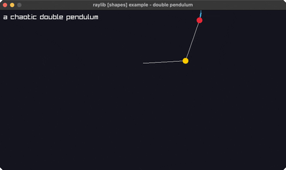

<!-- Generated by `bb resync` from raylib-jlt. Edits here are overwritten. -->
# double-pendulum

chaotic double-pendulum motion + trail

Category: shapes



## Run it

```sh
cd double-pendulum && jolt -M:run   # from this demo
jolt -M:double-pendulum             # from the repo root
```

## About

raylib [shapes] example - double pendulum (`joltc -M:double-pendulum`).

A chaotic double pendulum integrated with the standard equations of motion,
with a fading trail of the lower bob. Pure math over lines + circles.
