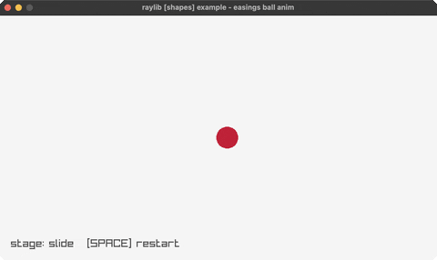

# easings-ball

slide, swell and fade, one curve each

Category: shapes



## Run it

```sh
cd easings-ball && bb run   # from this demo (or jolt run, jolt -M:run)
bb easings-ball             # from the repo root (or jolt -M:easings-ball)
```

## About

raylib [shapes] example - easings ball anim (`jolt -M:easings-ball`).

Port of raylib's examples/shapes/shapes_easings_ball.c. A ball slides in,
swells until it fills the window, then fades out. SPACE restarts.

Three stages, each one curve on one property, which is the point: the ball
never moves and grows at the same time. Reading them in order shows what each
curve feels like in isolation.

- Slide in on EaseElasticOut. It overshoots and springs back, so the ball
  arrives past centre and settles.
- Swell on EaseElasticIn. The mirror image: almost nothing happens for most of
  the duration, then it snaps.
- Fade on EaseCubicOut, which is smooth and unremarkable on purpose, so the
  two elastic stages stand out against it.

Curves come from reasings, the shared counterpart of raylib's reasings.h, and
keep its (t, b, c, d) signature. See easings for all of them at once.
