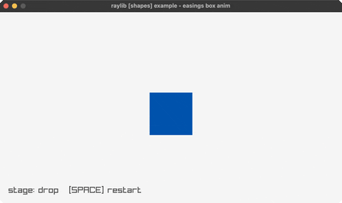

<!-- Generated by `bb resync` from raylib-jlt. Edits here are overwritten. -->
# easings-box

drop, flatten, spin, grow, fade: five curves

Category: shapes



## Run it

```sh
cd easings-box && bb run   # from this demo (or jolt run, jolt -M:run)
bb easings-box             # from the repo root (or jolt -M:easings-box)
```

## About

raylib [shapes] example - easings box anim (`jolt -M:easings-box`).

Port of raylib's examples/shapes/shapes_easings_box.c. A square drops in,
flattens into a bar, spins, grows to fill the window, then fades. SPACE
restarts.

Five stages, a different curve on each, chosen to contrast rather than to look
uniform:

- Drop on EaseElasticOut, which overshoots and springs back.
- Flatten on EaseBounceOut, so the bar settles in decreasing hops.
- Spin 270 degrees on EaseQuadOut, a plain decelerate against the two springy
  stages either side of it.
- Grow on EaseCircOut, which starts fast and brakes hard.
- Fade on EaseSineOut, the gentlest of them, so the end is unhurried.

The square rotates about its own centre, which needs DrawRectanglePro. That
takes a Rectangle and a Vector2 by value and is not bindable, so rect-pro!
draws it as an rlgl quad.

Curves come from reasings, keeping raylib's (t, b, c, d) signature. See
easings-ball for the same idea on three stages, and easings for the whole
family side by side.
