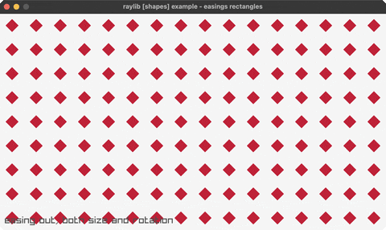

<!-- Generated by `bb resync` from raylib-jlt. Edits here are overwritten. -->
# easings-rectangles

a grid easing out in size and rotation at once

Category: shapes



## Run it

```sh
cd easings-rectangles && jolt -M:run   # from this demo
jolt -M:easings-rectangles             # from the repo root
```

## About

raylib [shapes] example - easings rectangles (`jolt -M:easings-rectangles`).

Port of raylib's examples/shapes/shapes_easings_rectangles.c. A grid of
rectangles collapses to nothing while the whole field spins, then SPACE plays
it again.

Both the shrink and the spin are the same easing curve, EaseCircOut, run over
the same frame counter. That is what makes the animation read as one movement
rather than two: the rectangles are smallest exactly when the rotation settles.
A circular ease-out starts fast and decelerates hard, which is why the grid
seems to snap away and then drift the last few degrees.

raylib's easing signature is (t, b, c, d): current time, begin value, total
change, duration. It is worth keeping rather than normalising to [0,1], because
passing a negative change is how the C shrinks rather than grows, and the call
sites read the same as the original.

Each rectangle rotates about its own centre, which needs DrawRectanglePro.
That takes a Rectangle and a Vector2 by value, so it is not bindable; rect-pro!
draws the same thing as an rlgl quad.

See easings for the curve family compared side by side.
