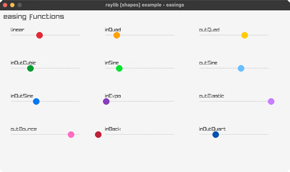

<!-- Generated by `bb resync` from raylib-jlt. Edits here are overwritten. -->
# easings

a grid of balls, each on a different easing curve

Category: shapes

Ported from raylib's `examples/shapes/shapes_easings_*` programs.



## Run it

```sh
cd easings && bb run   # from this demo (or jolt run, jolt -M:run)
bb easings             # from the repo root (or jolt -M:easings)
```

## About

raylib [shapes] example - easings. A 3x4 grid of tracks, each animating a ball
across the lane with a different easing function of a ping-ponging t in [0,1].
Spirit of shapes_easings_*; all easings are pure math (pow / sin / cos).
