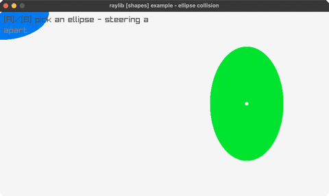

# ellipse-collision

two ellipses that redden when they overlap

Category: shapes



## Run it

```sh
cd ellipse-collision && bb run   # from this demo (or jolt run, jolt -M:run)
bb ellipse-collision             # from the repo root (or jolt -M:ellipse-collision)
```

## About

raylib [shapes] example - ellipse collision (`jolt -M:ellipse-collision`).

Port of raylib's examples/shapes/shapes_ellipse_collision.c. Two ellipses, one
following the mouse. Both turn red when they overlap. A and B choose which one
you are steering.

DrawEllipse is bound, DrawEllipseLines is not, so the outlines are a line loop
through rlgl immediate mode. That is the same trade the rest of the suite makes
for Vector2-taking shape calls, and it costs one helper.

The overlap test is the interesting part. Two ellipses do not have a closed-form
intersection test the way two circles do, so raylib samples: it walks points
around one ellipse's rim and asks whether any lands inside the other. That is
approximate, and the sample count is the accuracy. Point-in-ellipse itself is
exact, being the unit-circle test after dividing out each radius.
