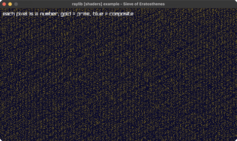

<!-- Generated by `bb resync` from raylib-jlt. Edits here are overwritten. -->
# eratosthenes-sieve

the Sieve of Eratosthenes, one test per pixel

Category: shaders



## Run it

```sh
cd eratosthenes-sieve && jolt -M:run   # from this demo
jolt -M:eratosthenes-sieve             # from the repo root
```

## About

raylib [shaders] example - Sieve of Eratosthenes.

The Sieve of Eratosthenes computed per pixel in a fragment shader: each
pixel maps to an integer, primes light up, composites are dimmed by their
smallest factor. No uniforms beyond the window resolution and no input --
the whole example is the shader, following the same full-window rl/rect!
+ rl/with-shader pattern as julia-set.clj (no render texture needed).
