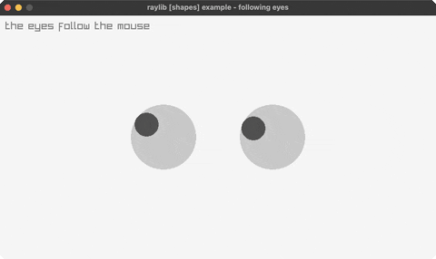

<!-- Generated by `bb resync` from raylib-jlt. Edits here are overwritten. -->
# eyes

two eyes track the mouse

Category: shapes



## Run it

```sh
cd eyes && jolt -M:run   # from this demo
jolt -M:eyes             # from the repo root
```

## About

raylib [shapes] example - following eyes (`joltc -M:eyes`).

Ported from examples/shapes/shapes_following_eyes.c: two eyes whose pupils track
the mouse cursor, each pupil clamped to stay inside its eye. Uses scalar
GetMouseX / GetMouseY + DrawCircle and a little trig for the pupil offset.
