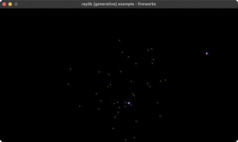

<!-- Generated by `bb resync` from raylib-jlt. Edits here are overwritten. -->
# fireworks

rockets + fading particle bursts

Category: generative



## Run it

```sh
cd fireworks && jolt -M:run   # from this demo
jolt -M:fireworks             # from the repo root
```

## About

raylib [generative] example - fireworks. Rockets rise and explode into particles
that fall under gravity and fade out via the alpha channel.
