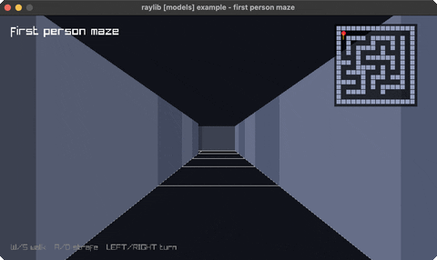

<!-- Generated by `bb resync` from raylib-jlt. Edits here are overwritten. -->
# first-person-maze

walk a grid maze, with a minimap

Category: 3d



## Run it

```sh
cd first-person-maze && bb run   # from this demo (or jolt run, jolt -M:run)
bb first-person-maze             # from the repo root (or jolt -M:first-person-maze)
```

## About

raylib [models] example - first person maze (`jolt -M:first-person-maze`).

Walk a grid maze in first person: W/S move along the heading, A/D strafe,
LEFT/RIGHT turn. A minimap in the corner shows the layout and where you are
facing. Walls stop you a little short of the surface so you never end up inside
one and see the world from the wrong side.

The maze is a vector of strings, which doubles as the collision map: a move is
accepted only if the destination cell is open, tested per axis so sliding along
a wall works instead of sticking. Walls are rl/cube! columns, so the whole scene
is rlgl immediate-mode geometry under a Camera3D.
