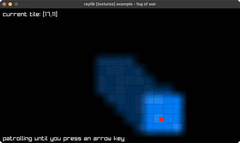

# fog-of-war

fog lifted by a 25x15 render texture

Category: textures



## Run it

```sh
cd fog-of-war && bb run   # from this demo (or jolt run, jolt -M:run)
bb fog-of-war             # from the repo root (or jolt -M:fog-of-war)
```

## About

raylib [textures] example - fog of war (`jolt -M:fog-of-war`).

Port of raylib's examples/textures/textures_fog_of_war.c. A 25x15 tile map
under a fog that lifts where the player has been: arrow keys walk, tiles
within two of the player go clear, and tiles walked through earlier stay at a
dimmer remembered fog rather than going black again.

Zero new FFI, and the trick is the same one the C uses. The fog is drawn into
a render texture that is exactly ONE PIXEL PER TILE, 25x15, then stretched over
the whole map on the way out. Bilinear filtering does the rest: the hard edges
between a lit tile and a dark one come back as a smooth gradient for free,
which is far cheaper than drawing a soft-edged sprite per tile. `render-texture`
already sets the LINEAR filter and CLAMP wrap that needs.

The deviation is idle motion: the player walks a patrol loop until an arrow key
is pressed, because no synthetic input actuates a raylib window (see the note
in scripts/demo_manifest.edn) and a fog that never lifts is a single frame.
