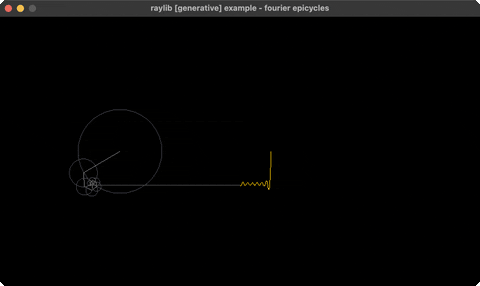

# fourier-epicycles

rotating circles trace a square wave

Category: generative



## Run it

```sh
cd fourier-epicycles && bb run   # from this demo (or jolt run, jolt -M:run)
bb fourier-epicycles             # from the repo root (or jolt -M:fourier-epicycles)
```

## About

raylib [generative] example - a chain of rotating circles (a Fourier series for a
square wave) whose tip traces the wave. Classic 'drawing with epicycles'.
