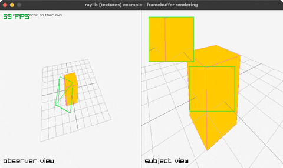

<!-- Generated by `bb resync` from raylib-jlt. Edits here are overwritten. -->
# framebuffer-rendering

two cameras, two framebuffers, one scene

Category: textures



## Run it

```sh
cd framebuffer-rendering && bb run   # from this demo (or jolt run, jolt -M:run)
bb framebuffer-rendering             # from the repo root (or jolt -M:framebuffer-rendering)
```

## About

raylib [textures] example - framebuffer rendering (`jolt -M:framebuffer-rendering`).

Port of raylib's examples/textures/textures_framebuffer_rendering.c. The same
scene twice, side by side, each rendered into its own framebuffer before
anything reaches the window. On the left an observer watches the scene AND the
other camera, drawn as its own view frustum; on the right is what that second
camera actually sees. The green square in the middle of the right view is
copied out again as the inset in its corner, which is the same texture sampled
through a different source rectangle.

Zero new FFI. `rl/render-texture` and `rl/with-render-texture` are the scalar
rlgl spelling of BeginTextureMode that the suite has had since `render-texture`,
and the inset is `rl/texture!` with `:u0`/`:v0`/`:u1`/`:v1` narrowed to the
middle 128 pixels rather than a second render pass. Note both views are drawn
with `:v0 1.0 :v1 0.0`, since a framebuffer texture is stored bottom-up.

The frustum is worth the few lines it costs. It is built from the subject
camera's own position, target and field of view, so the wireframe on the left
is not a drawing OF the right-hand view, it is the geometry that produced it,
and the two move together because they are the same numbers.

Deviation: the C drives the observer with CAMERA_FREE on a captured pointer.
Both cameras orbit on their own here, at different rates, since no synthetic
input actuates a raylib window (see scripts/demo_manifest.edn) and the C's
subject camera is on CAMERA_ORBITAL anyway, which takes no input either.
