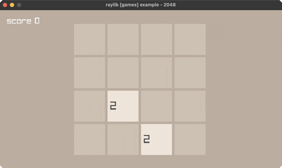

<!-- Generated by `bb resync` from raylib-jlt. Edits here are overwritten. -->
# game-2048

2048: 4x4 tile-merge puzzle (arrow keys)

Category: games



## Run it

```sh
cd game-2048 && jolt -M:run   # from this demo
jolt -M:game-2048             # from the repo root
```

## About

raylib [games] example - 2048. Arrow keys slide + merge tiles on a 4x4 board;
reach 2048. Slide/merge is one pure function reused for all four directions via
row reversal / transpose. (Handle is game-2048; bb can't name a task '2048'.)
