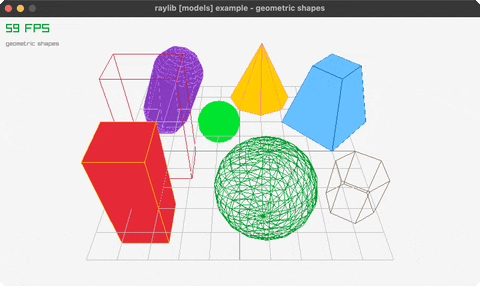

<!-- Generated by `bb resync` from raylib-jlt. Edits here are overwritten. -->
# geometric-shapes

cubes, spheres, cylinders, cones, capsules

Category: 3d



## Run it

```sh
cd geometric-shapes && jolt -M:run   # from this demo
jolt -M:geometric-shapes             # from the repo root
```

## About

raylib [models] example - geometric shapes.

A static 3D scene of cubes, spheres, cylinders, cones and capsules (solid
+ wireframe) over a grid, viewed through a fixed perspective camera. The
first example to use the genuine by-value Draw{Cube,Sphere,Cylinder,
Capsule}* calls (draw-cube!, draw-sphere!, etc. in net.b12n.raylib.models)
rather than the rlgl immediate-mode stand-ins rl/cube!/rl/sphere! use -- a cone here
is a cylinder with a zero top radius, the same trick raylib's own example
uses. Ported from raylib's examples/models/models_geometric_shapes.c.
