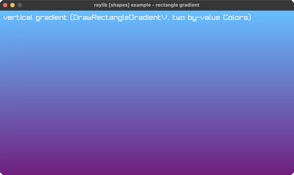

# gradient

a vertical two-color gradient

Category: shapes



## Run it

```sh
cd gradient && bb run   # from this demo (or jolt run, jolt -M:run)
bb gradient             # from the repo root (or jolt -M:gradient)
```

## About

raylib [shapes] example - rectangle gradient (`joltc -M:gradient`).

A full-window vertical gradient via DrawRectangleGradientV, which takes TWO
Colors by value, a good check that more than one 4-byte by-value struct can be
passed in a single call.

## Background in the raylib-jlt guide

- [`Color` passed by value, as a packed `:uint`](https://github.com/jlt-commons/raylib-jlt/blob/main/docs/guide/color-by-value.md)
