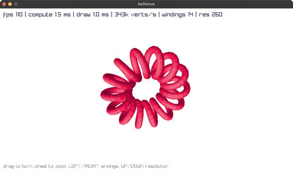

<!-- Generated by `bb resync` from raylib-jlt. Edits here are overwritten. -->
# helitorus

a helix wound around a torus, swept into a tube

Category: 3d



## Run it

```sh
cd helitorus && bb run   # from this demo (or jolt run, jolt -M:run)
bb helitorus             # from the repo root (or jolt -M:helitorus)
```

## About

A helix wound around a torus, swept into a tube (`jolt -M:helitorus`).

Drag to turn, wheel to zoom, LEFT/RIGHT change the number of windings,
UP/DOWN the resolution along the spine.

The surface is generated rather than modelled: walk the spine of a helix that
itself follows a torus, build a local frame (tangent, normal, binormal) at each
point, sweep a circle around that frame, and you have a tube. Projection,
lighting and hidden-surface removal are all done here rather than by raylib —
which is the interesting part next to the Camera3D examples, because it shows
what the rlgl layer alone can carry.

Two things make it fast enough to animate at this vertex count. `compute!`
writes into PRIMITIVE ARRAYS reused every frame, so a frame of ~10k vertices
allocates nothing. And hidden surfaces are handled by the painter's algorithm
over an `order` array that SURVIVES THE FRAME: consecutive frames differ by a
small rotation, so the array starts almost sorted and the insertion sort over
it is nearly linear.

The HUD separates compute time from draw time, which is the honest way to read
them: one is jolt arithmetic and the other is the FFI submitting vertices.

Backface culling is switched off (`rl/rl-disable-backface-culling`) because
this example decides visibility itself, by the sign of a 2D cross product in
screen space. That is not a winding rule, and raylib's cull would drop exactly
the faces the test keeps — see the note in net.b12n.raylib.rlgl.
