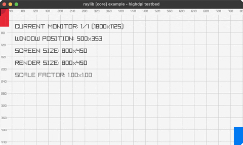

<!-- Generated by `bb resync` from raylib-jlt. Edits here are overwritten. -->
# highdpi-testbed

diagnostic overlay: monitors, DPI, crosshair

Category: core



## Run it

```sh
cd highdpi-testbed && jolt -M:run   # from this demo
jolt -M:highdpi-testbed             # from the repo root
```

## About

raylib [core] example - highdpi testbed.

A diagnostic overlay for HighDPI / multi-monitor setups: a labelled
pixel grid, the current monitor + window position + screen/render size
+ DPI scale factor, corner reference rectangles, and a mouse crosshair
with live coordinates. SPACE toggles borderless-windowed, F toggles
fullscreen.

Three new bindings: rl/get-window-scale-dpi and rl/get-window-position
are genuinely by-value Vector2 returns (the same GetWorldToScreen
out-pointer pattern world-to-screen already uses in net.b12n.raylib.camera), and
rl/toggle-borderless-windowed! is a plain void call. Everything else
(monitor count/current/width/height, render/screen size, toggle
fullscreen) was already bound.

Deliberately does NOT set FLAG_WINDOW_HIGHDPI, unlike raylib's own C
example: on this suite's headless verification environment, that flag
makes the render target 2x the window size as intended, but then the
screenshot capture doubles the scale again on top of that, so the
drawn content only fills one quadrant of the dumped PNG. Confirmed
with a 3-line probe (a solid rect, no other code involved) before
concluding it wasn't this file's logic. The diagnostic overlay is
still useful without the flag; SCALE FACTOR just reads 1.00x1.00.
Ported from raylib's examples/core/core_highdpi_testbed.c.
