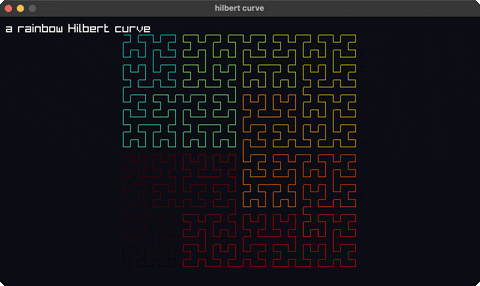

# hilbert-curve

a rainbow Hilbert space-filling curve

Category: shapes



## Run it

```sh
cd hilbert-curve && bb run   # from this demo (or jolt run, jolt -M:run)
bb hilbert-curve             # from the repo root (or jolt -M:hilbert-curve)
```

## About

A Hilbert curve (`joltc -M:hilbert-curve`).

A rainbow Hilbert space-filling curve generated recursively (the classic turtle
algorithm) into a point list, then drawn as connected line segments.
