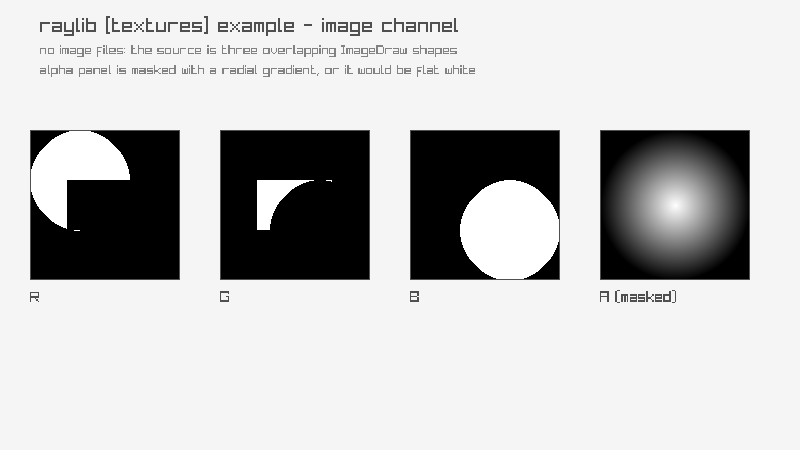

# image-channel

R/G/B/A split; alpha masked to show structure

Category: textures



## Run it

```sh
cd image-channel && bb run   # from this demo (or jolt run, jolt -M:run)
bb image-channel             # from the repo root (or jolt -M:image-channel)
```

## About

raylib [textures] example - image channel (`jolt -M:image-channel`).

Port of raylib's examples/textures/textures_image_channel.c, adapted
rather than faithfully ported: the C loads a picture from disk, and this
suite ships no image files, so the source here is three overlapping
shapes (ImageDrawCircle x2, ImageDrawRectangle, the family
net.b12n.raylib-jlt.image-drawing introduced) painted in pure red,
green and blue, so each of the R/G/B channels below owns a different
region rather than three copies of the same gradient.

A flat, opaque source has nothing in its alpha channel: alpha is 255
everywhere, so ImageFromChannel on channel 3 would come back uniformly
white and teach nothing. This applies ImageAlphaMask first, with a
GenImageGradientRadial as the mask, so the alpha panel carries the same
radial falloff the mask does and genuinely differs from the other
three.

ImageFromChannel returns a new Image by value for every call, four of
them here on top of the source and the mask: all six get an explicit
UnloadImage, since a leak here fails no gate.
