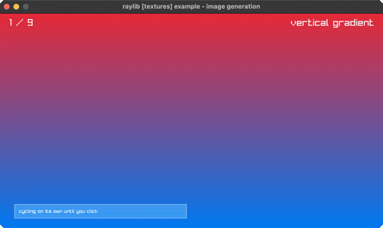

<!-- Generated by `bb resync` from raylib-jlt. Edits here are overwritten. -->
# image-generation

nine procedural textures, none of them loaded

Category: textures



## Run it

```sh
cd image-generation && jolt -M:run   # from this demo
jolt -M:image-generation             # from the repo root
```

## About

raylib [textures] example - image generation (`jolt -M:image-generation`).

Port of raylib's examples/textures/textures_image_generation.c. Nine
full-screen textures, none of them loaded from anywhere: click or press RIGHT
to cycle through three linear gradients, a radial and a square one, a
checkerboard, white noise, Perlin noise and a cellular field. Each one is
generated once at startup and lives on the GPU from then on.

This is the first example on the suite's new `Image` bindings, and the
generators are exactly why they were worth having. `Image` is
`{void *data; int width, height, mipmaps, format;}`, 24 bytes returned by
value from every `GenImage*` call and taken by value by everything that
consumes one. That has been expressible since jolt 0.7.23 and nothing here
had used it for pixels yet.

What `rl/image-*` hands back is an rlgl texture id rather than the `Image` or
the `Texture2D`, which is what makes this a small addition rather than a new
drawing path: `texture!`, `texture-filter!` and `unload-texture!` all speak ids
already, so a generated image draws through the same code a `texture-from-fn`
one does. The `Image` itself is freed inside the call, once its pixels have
reached the GPU.

Deviation: the view cycles on its own every couple of seconds until you click
or press a key, since no synthetic input actuates a raylib window (see the note
in scripts/demo_manifest.edn) and a single texture held still is one frame.
