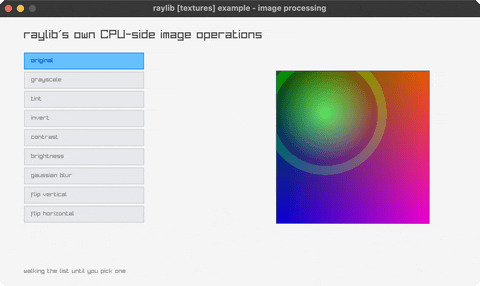

# image-processing

nine CPU-side image operations, picked live

Category: textures



## Run it

```sh
cd image-processing && bb run   # from this demo (or jolt run, jolt -M:run)
bb image-processing             # from the repo root (or jolt -M:image-processing)
```

## About

raylib [textures] example - image processing (`jolt -M:image-processing`).

Port of raylib's examples/textures/textures_image_processing.c. Nine
operations over the same picture, picked from the list on the left with the
mouse or the arrow keys: grayscale, tint, invert, contrast, brightness, a
Gaussian blur, and both flips. Each one is raylib's own, running over CPU
pixels rather than in a shader.

Note how differently these bind from the generators next to them in
net.b12n.raylib.images. Every processor takes `Image *` and works IN PLACE, so it is a
plain pointer argument and the 24-byte by-value dance never arises; only
`ImageCopy` and `LoadImageFromTexture` move whole Images across the boundary.

`LoadImageFromTexture` is the one that makes this example possible at all. The
C opens `resources/parrots.png`, and this suite ships no image files, so the
source here is drawn pixel by pixel with `texture-from-fn`, pulled BACK off the
GPU into CPU memory, and handed to raylib from there. The pattern is
deliberately lopsided, with the bright lobe off-centre, so that a flip is
obvious rather than something you have to take on trust.

The processed image is rebuilt only when the selection changes. A blur over a
256x256 image every frame would be visible in the frame time for no reason,
and the result cannot change while the mode is held.
