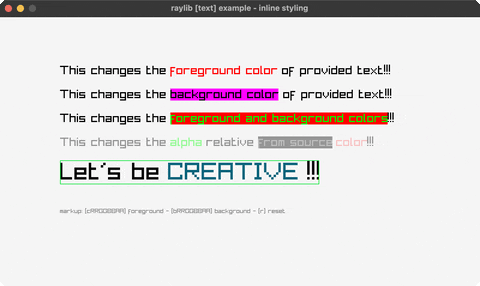

<!-- Generated by `bb resync` from raylib-jlt. Edits here are overwritten. -->
# inline-styling

colour markup inside the string itself

Category: text



## Run it

```sh
cd inline-styling && bb run   # from this demo (or jolt run, jolt -M:run)
bb inline-styling             # from the repo root (or jolt -M:inline-styling)
```

## About

raylib [text] example - inline styling (`jolt -M:inline-styling`).

Port of raylib's examples/text/text_inline_styling.c. A tiny markup inside the
string itself sets colours mid-line: `[cRRGGBBAA]` changes the foreground,
`[bRRGGBBAA]` paints a background behind the run, and `[r]` puts both back. The
alphas in the markup are multiplied by the base colour's alpha, so one fade
value still controls the whole line while each run keeps its own styling.

Zero new FFI. The C draws through `DrawTextEx` with an explicit Font and
spacing; `MeasureText` and `DrawText` are already bound here and answer the
same questions for the default font, so the parser is the whole example and it
is ordinary Clojure. The parse is deliberately positional rather than a regex
sweep: a tag is either `[r]` or a letter plus exactly eight hex digits in
brackets, and anything that does not fit that shape is text, including a
stray `[`.
