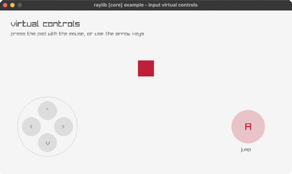

<!-- Generated by `bb resync` from raylib-jlt. Edits here are overwritten. -->
# input-virtual-controls

an on-screen D-pad and action button

Category: core



## Run it

```sh
cd input-virtual-controls && bb run   # from this demo (or jolt run, jolt -M:run)
bb input-virtual-controls             # from the repo root (or jolt -M:input-virtual-controls)
```

## About

raylib [core] example - input virtual controls (`jolt -M:input-virtual-controls`).

An on-screen D-pad and action button, the control scheme a touch device needs
when there is no keyboard. Press a pad segment with the mouse to move the
square; the A button makes it hop. The keyboard arrows drive the same state, so
the two input paths stay interchangeable.

There is nothing raylib-specific about the hit testing: each segment is a circle
and a wedge of angle around the pad's centre, both plain arithmetic, which is
what keeps the control layout independent of the drawing API.
