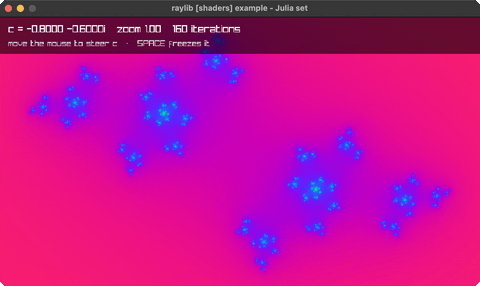

# julia-set

the Julia set, mouse-steered, in a shader

Category: shaders



## Run it

```sh
cd julia-set && bb run   # from this demo (or jolt run, jolt -M:run)
bb julia-set             # from the repo root (or jolt -M:julia-set)
```

## About

raylib [shaders] example - Julia set (`jolt -M:julia-set`).

The Julia set for c = (cRe, cIm), evaluated per pixel in a fragment shader.
Moving the mouse steers c around the unit circle, which is what makes the shape
breathe between a connected blob and scattered dust: the set is connected
exactly when c lies inside the Mandelbrot set. SPACE freezes c so a shape can be
examined, the wheel zooms, UP/DOWN change the iteration cap.

The whole image is one full-window rectangle drawn inside rl/with-shader; there
is no per-pixel work on this side at all. Uniforms exercised: vec2 (uC,
uResolution), float (uZoom), int (uIter).

gl_FragCoord has its origin at the BOTTOM left, unlike raylib's 2D coordinates,
so the y flip happens in the shader rather than in the mouse maths here.
