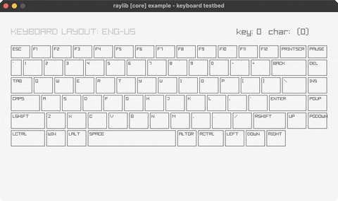

<!-- Generated by `bb resync` from raylib-jlt. Edits here are overwritten. -->
# keyboard-testbed

an on-screen ENG-US keyboard, every key lit

Category: core



## Run it

```sh
cd keyboard-testbed && bb run   # from this demo (or jolt run, jolt -M:run)
bb keyboard-testbed             # from the repo root (or jolt -M:keyboard-testbed)
```

## About

raylib [core] example - keyboard testbed.

An on-screen ENG-US keyboard: every key you hold lights up MAROON, the key
under the mouse gets a red overlay, and the last GetKeyPressed/
GetCharPressed codes are shown top-right. `rl/set-exit-key rl/KEY-NULL`
disables the ESC shortcut (ESC is a testbed key here) -- close the window
to quit. No new bindings: point-in-rect is plain arithmetic instead of
CheckCollisionPointRec, and Fade(RED, 0.2) is just rl/rgba with a reduced
alpha byte. Ported from raylib's examples/core/core_keyboard_testbed.c.
