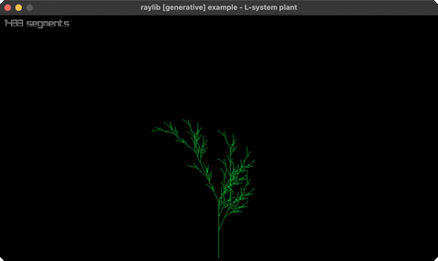

<!-- Generated by `bb resync` from raylib-jlt. Edits here are overwritten. -->
# l-system

an L-system fractal plant (grows + regrows)

Category: generative



## Run it

```sh
cd l-system && bb run   # from this demo (or jolt run, jolt -M:run)
bb l-system             # from the repo root (or jolt -M:l-system)
```

## About

raylib [generative] example - an L-system fractal plant. A string is rewritten by
production rules, then drawn with turtle graphics (F=forward, +/-=turn, []=branch);
the plant reveals itself segment by segment, then regrows.
