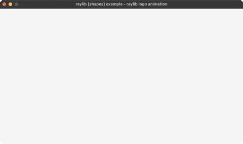

<!-- Generated by `bb resync` from raylib-jlt. Edits here are overwritten. -->
# logo-anim

the raylib logo assembling itself, unsmoothed

Category: shapes



## Run it

```sh
cd logo-anim && jolt -M:run   # from this demo
jolt -M:logo-anim             # from the repo root
```

## About

raylib [shapes] example - raylib logo animation (`jolt -M:logo-anim`).

Port of raylib's examples/shapes/shapes_logo_raylib_anim.c. The raylib logo
assembles itself: a blinking square, then the top and left bars grow, then the
bottom and right close the frame, then the letters arrive one at a time and the
whole thing fades. R replays it.

Nothing here is eased. Every stage advances by a fixed step per frame, and the
stage changes when a counter hits an exact value, which is how the original
reads and why it feels mechanical rather than smooth. That is worth preserving:
it is the counterpoint to easings-ball and easings-box sitting beside it in the
same group.

The letters appear by drawing a growing prefix of "raylib", one more every
twelve frames. raylib does that with TextSubtext; subs does it here.

See logo-raylib for the finished logo drawn in one pass.
